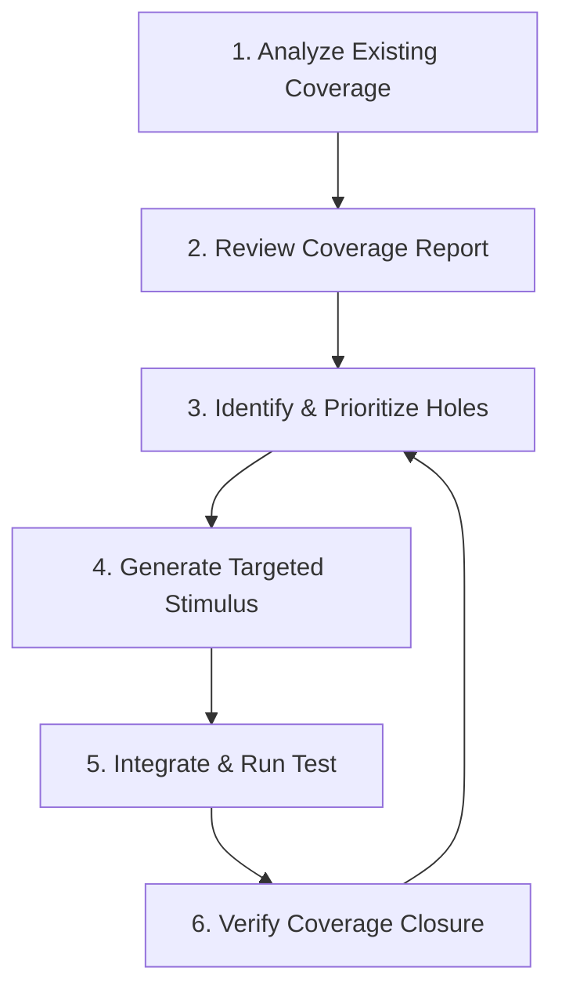

# Coverage Implementation Guide

## Overview

This guide describes how to implement and integrate comprehensive coverage for UVM tests. The primary goal for the agent is not to create new coverage infrastructure from scratch, but to **leverage and extend the existing coverage model**. The agent must generate stimulus that targets existing covergroups and, when necessary, augment them with new, specific coverage points.

---

## Part 1: Coverage Architecture & Integration Strategy

### 1.1. Existing Coverage Infrastructure (Case Study: `ip-csme`)

The `ip-csme` repository provides a mature coverage model that the agent should integrate with.

-   **Primary Functional Coverage File:**
    -   **Location**: `verif/csme_usbr/tb/moa_usbr_cov.sv`
    -   **Content**: This file contains the main transaction-level functional covergroups. **This is the most important file for the agent to parse and understand.**
-   **White-box Coverage:**
    -   **Location**: `verif/csme_usbr/tb/usbr_wb_cov/`
    -   **Content**: Contains covergroups targeting DUT-internal signals and logic. The agent should be aware of these to avoid duplicating coverage.
-   **Coverage Test Plan:**
    -   **Location**: `verif/csme_usbr/tests/coverage/CSME_USBR_COVERAGE_XLS.xlsx`
    -   **Implication**: If the agent has the capability to parse spreadsheets, this file provides the high-level coverage goals, which can be used to prioritize test generation.

### 1.2. AI Agent Workflow for Coverage Closure

The agent should follow an iterative process to analyze and close coverage holes.



1.  **Analyze Existing Coverage**: Parse `moa_usbr_cov.sv` and other `*_cov.sv` files to build an internal model of the entire functional coverage space (covergroups, coverpoints, and crosses).
2.  **Review Coverage Report**: Ingest a coverage database (e.g., from a regression run) to identify all uncovered bins.
3.  **Identify & Prioritize Holes**: Select a set of high-value, uncovered bins to target. This could be based on the test plan or other heuristics.
4.  **Generate Targeted Stimulus**: Create a new UVM sequence (e.g., `ai_generated_coverage_seq.sv`) that is specifically designed to produce the transaction-level stimulus needed to hit the target bins.
5.  **Integrate & Run Test**: Create a new test (`moa_usbr_ai_coverage_test.sv`) to run the new sequence, add it to the build, and execute it with coverage enabled.
6.  **Verify Coverage Closure**: Analyze the new coverage report to confirm that the targeted bins are now covered.

---

## Part 2: Functional Coverage Generation Templates

While the primary goal is to target existing covergroups, the agent may need to augment them.

### 2.1. Generic Feature Covergroup

This template can be used to generate a basic feature covergroup for a given protocol.

```systemverilog
covergroup {protocol_name}_features_cg @(posedge clk);
  // Protocol-specific coverage points
  transaction_type_cp: coverpoint transaction.trans_type {
    bins read = {READ};
    bins write = {WRITE};
  }
  
  data_size_cp: coverpoint transaction.data_size {
    bins small = {[1:8]};
    bins medium = {[9:64]};
    bins large = {[65:256]};
  }
  
  // Common coverage points
  outstanding_cp: coverpoint outstanding_count {
    bins single = {1};
    bins few = {[2:4]};
    bins many = {[5:16]};
  }
endcovergroup
```

### 2.2. Cross Coverage

Cross coverage is essential for verifying interactions between different features.

```systemverilog
covergroup {protocol_name}_cross_cg @(posedge clk);
  // Individual coverpoints
  burst_type_cp: coverpoint transaction.burst_type;
  transfer_size_cp: coverpoint transaction.transfer_size;
  
  // Cross between burst type and transfer size
  burst_size_cross: cross burst_type_cp, transfer_size_cp {
    // Exclude any illegal combinations to avoid noise
    illegal_bins illegal_combo = binsof(burst_type_cp) intersect {FIXED} &&
                                 binsof(transfer_size_cp) intersect {3, 5};
  }
endcovergroup
```

### 2.3. Scenario Coverage

Scenario coverage tracks sequences of events or state transitions.

```systemverilog
covergroup scenario_coverage_cg;
  // FSM state transition coverage
  state_transition_cp: coverpoint current_state {
    bins idle_to_active = (IDLE => ACTIVE);
    bins active_to_error = (ACTIVE => ERROR);
    bins error_to_idle = (ERROR => IDLE);
  }
  
  // Coverage for specific error scenarios
  error_scenario_cp: coverpoint error_type {
    bins timeout = {TIMEOUT_ERROR};
    bins protocol_violation = {PROTOCOL_ERROR};
  }
endcovergroup
```

---

## Part 3: Coverage Collection and Integration

### 3.1. Coverage Collector Component

A `uvm_subscriber` is the standard way to implement a coverage collector that listens for transactions from a monitor.

```systemverilog
class {test_name}_coverage extends uvm_subscriber#({transaction_type});
  `uvm_component_utils({test_name}_coverage)
  
  // Instantiate all relevant covergroups
  {protocol_name}_features_cg m_features_cg;
  {protocol_name}_cross_cg m_cross_cg;
  
  function new(string name, uvm_component parent);
    super.new(name, parent);
    m_features_cg = new();
    m_cross_cg = new();
  endfunction
  
  // The write method is called for every transaction from the monitor
  virtual function void write({transaction_type} t);
    // Sample all covergroups with the received transaction
    m_features_cg.sample(t);
    m_cross_cg.sample(t);
  endfunction
endclass
```

### 3.2. Connecting the Collector in the Environment

The coverage collector must be instantiated in the environment and connected to the monitor's analysis port.

```systemverilog
class {test_name}_env extends uvm_env;
  // ... other components
  {agent_name} m_agent;
  {test_name}_coverage m_coverage;
  
  virtual function void build_phase(uvm_phase phase);
    // ...
    m_agent = {agent_name}::type_id::create("m_agent", this);
    m_coverage = {test_name}_coverage::type_id::create("m_coverage", this);
  endfunction
  
  virtual function void connect_phase(uvm_phase phase);
    // Connect the agent's analysis port to the coverage subscriber
    m_agent.ap.connect(m_coverage.analysis_export);
  endfunction
endclass
```
