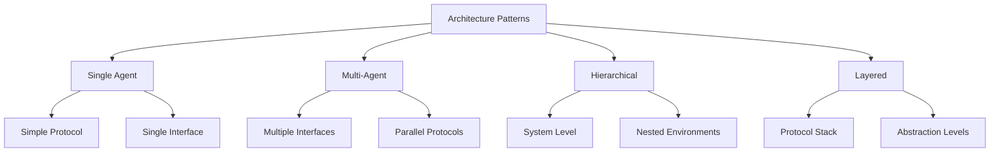

````markdown
# Architecture Patterns Guide

## Overview

This guide describes UVM/OVM/Saola testbench architecture patterns and how to automatically generate them from validation documents. The agent must understand and implement appropriate architectural patterns based on the extracted requirements.

## 1. Architecture Selection Framework

### 1.1 Pattern Decision Matrix

```python
def select_architecture_pattern(validation_doc):
    factors = {
        'protocol_complexity': analyze_protocol_complexity(validation_doc),
        'interface_count': count_interfaces(validation_doc),
        'verification_scope': determine_verification_scope(validation_doc),
        'methodology': extract_methodology(validation_doc)
    }
    
    if factors['interface_count'] == 1 and factors['protocol_complexity'] == 'simple':
        return 'single_agent_pattern'
    elif factors['interface_count'] > 1 and factors['verification_scope'] == 'block':
        return 'multi_agent_pattern'
    elif factors['verification_scope'] == 'system':
        return 'hierarchical_pattern'
    else:
        return 'layered_pattern'
```

### 1.2 Architecture Patterns Overview



## 2. Single Agent Architecture Pattern

### 2.1 When to Use
- Single interface verification
- Simple protocols (UART, SPI, I2C)
- Block-level testing
- Focused feature verification

### 2.2 Architecture Template

```systemverilog
// Single Agent Architecture
class {protocol}_env extends uvm_env;
  `uvm_component_utils({protocol}_env)
  
  // Core components
  {protocol}_agent agent;
  {protocol}_scoreboard sb;
  {protocol}_coverage cov;
  
  // Configuration
  {protocol}_env_config cfg;
  
  function new(string name = "{protocol}_env", uvm_component parent = null);
    super.new(name, parent);
  endfunction
  
  virtual function void build_phase(uvm_phase phase);
    super.build_phase(phase);
    
    // Get configuration
    if (!uvm_config_db#({protocol}_env_config)::get(this, "", "config", cfg)) begin
      cfg = {protocol}_env_config::type_id::create("cfg");
    end
    
    // Create components
    agent = {protocol}_agent::type_id::create("agent", this);
    sb = {protocol}_scoreboard::type_id::create("sb", this);
    cov = {protocol}_coverage::type_id::create("cov", this);
    
    // Configure agent
    uvm_config_db#({protocol}_agent_config)::set(this, "agent", "config", cfg.agent_cfg);
  endfunction
  
  virtual function void connect_phase(uvm_phase phase);
    super.connect_phase(phase);
    
    // Connect analysis ports
    agent.monitor.analysis_port.connect(sb.analysis_export);
    agent.monitor.analysis_port.connect(cov.analysis_export);
  endfunction
endclass
```

### 2.3 Agent Structure

```systemverilog
class {protocol}_agent extends uvm_agent;
  `uvm_component_utils({protocol}_agent)
  
  // Agent components
  {protocol}_driver driver;
  {protocol}_monitor monitor;
  {protocol}_sequencer sequencer;
  
  // Configuration
  {protocol}_agent_config cfg;
  
  virtual function void build_phase(uvm_phase phase);
    super.build_phase(phase);
    
    // Get configuration
    if (!uvm_config_db#({protocol}_agent_config)::get(this, "", "config", cfg)) begin
      `uvm_fatal("CONFIG", "Agent configuration not found")
    end
    
    // Create components based on configuration
    monitor = {protocol}_monitor::type_id::create("monitor", this);
    
    if (cfg.is_active == UVM_ACTIVE) begin
      driver = {protocol}_driver::type_id::create("driver", this);
      sequencer = {protocol}_sequencer::type_id::create("sequencer", this);
    end
  endfunction
  
  virtual function void connect_phase(uvm_phase phase);
    super.connect_phase(phase);
    
    if (cfg.is_active == UVM_ACTIVE) begin
      driver.seq_item_port.connect(sequencer.seq_item_export);
    end
  endfunction
endclass
```

## 3. Multi-Agent Architecture Pattern

### 3.1 When to Use
- Multiple independent interfaces
- Parallel protocol verification
- Cross-interface interactions
- System integration testing

### 3.2 Architecture Template

```systemverilog
class multi_agent_env extends uvm_env;
  `uvm_component_utils(multi_agent_env)
  
  // Multiple agents

  {{ agent.type }} {{ agent.name }};

  
  // Cross-agent components
  multi_protocol_scoreboard sb;
  system_coverage cov;
  virtual_sequencer vseqr;
  
  // Configuration
  multi_agent_env_config cfg;
  
  virtual function void build_phase(uvm_phase phase);
    super.build_phase(phase);
    
    // Create agents

    {{ agent.name }} = {{ agent.type }}::type_id::create("{{ agent.name }}", this);

    
    // Create system components
    sb = multi_protocol_scoreboard::type_id::create("sb", this);
    cov = system_coverage::type_id::create("cov", this);
    vseqr = virtual_sequencer::type_id::create("vseqr", this);
  endfunction
  
  virtual function void connect_phase(uvm_phase phase);
    super.connect_phase(phase);
    
    // Connect to virtual sequencer

    if ({{ agent.name }}.cfg.is_active == UVM_ACTIVE) begin
      vseqr.{{ agent.name }}_seqr = {{ agent.name }}.sequencer;
    end

    
    // Connect to scoreboard

    {{ agent.name }}.monitor.analysis_port.connect(sb.{{ agent.name }}_export);

  endfunction
endclass
```

### 3.3 Virtual Sequencer Pattern

```systemverilog
class virtual_sequencer extends uvm_sequencer;
  `uvm_component_utils(virtual_sequencer)
  
  // Sequencer handles

  {{ agent.sequencer_type }} {{ agent.name }}_seqr;

  
  function new(string name = "virtual_sequencer", uvm_component parent = null);
    super.new(name, parent);
  endfunction
endclass

class virtual_sequence extends uvm_sequence;
  `uvm_object_utils(virtual_sequence)
  
  // Virtual sequencer handle
  virtual_sequencer vseqr;
  
  virtual task body();
    // Cross-agent sequence coordination
    fork

      begin
        // {{ sequence_group.description }}

        {{ sequence.name }}_seq.start(vseqr.{{ sequence.agent }}_seqr);

      end

    join
  endtask
endclass
```

## 4. Hierarchical Architecture Pattern

### 4.1 When to Use
- System-level verification
- Nested verification environments
- IP integration testing
- Complex SoC verification

### 4.2 Hierarchical Structure

```systemverilog
class system_env extends uvm_env;
  `uvm_component_utils(system_env)
  
  // Sub-environments

  {{ sub_env.type }} {{ sub_env.name }};

  
  // System-level components
  system_scoreboard system_sb;
  system_coverage system_cov;
  system_virtual_sequencer system_vseqr;
  
  virtual function void build_phase(uvm_phase phase);
    super.build_phase(phase);
    
    // Create sub-environments

    {{ sub_env.name }} = {{ sub_env.type }}::type_id::create("{{ sub_env.name }}", this);

    
    // Create system components
    system_sb = system_scoreboard::type_id::create("system_sb", this);
    system_cov = system_coverage::type_id::create("system_cov", this);
    system_vseqr = system_virtual_sequencer::type_id::create("system_vseqr", this);
  endfunction
  
  virtual function void connect_phase(uvm_phase phase);
    super.connect_phase(phase);
    
    // Connect sub-environment virtual sequencers

    system_vseqr.{{ sub_env.name }}_vseqr = {{ sub_env.name }}.vseqr;

    
    // System-level connections
    connect_system_analysis_ports();
  endfunction
endclass
```

### 4.3 System Virtual Sequencer

```systemverilog
class system_virtual_sequencer extends uvm_sequencer;
  `uvm_component_utils(system_virtual_sequencer)
  
  // Sub-environment virtual sequencers

  {{ sub_env.vseqr_type }} {{ sub_env.name }}_vseqr;

  
  function new(string name = "system_virtual_sequencer", uvm_component parent = null);
    super.new(name, parent);
  endfunction
endclass
```

## 5. Layered Architecture Pattern

### 5.1 When to Use
- Protocol stack verification
- Different abstraction levels
- Transaction-level modeling
- Performance analysis

### 5.2 Layered Structure

```systemverilog
class layered_env extends uvm_env;
  `uvm_component_utils(layered_env)
  
  // Protocol layers

  {{ layer.type }}_env {{ layer.name }}_env;

  
  // Layer adapters

  {{ adapter.type }} {{ adapter.name }};

  
  virtual function void build_phase(uvm_phase phase);
    super.build_phase(phase);
    
    // Create layer environments

    {{ layer.name }}_env = {{ layer.type }}_env::type_id::create("{{ layer.name }}_env", this);

    
    // Create adapters

    {{ adapter.name }} = {{ adapter.type }}::type_id::create("{{ adapter.name }}", this);

  endfunction
  
  virtual function void connect_phase(uvm_phase phase);
    super.connect_phase(phase);
    
    // Connect layers through adapters

    {{ connection.source }}.{{ connection.port }}.connect({{ connection.destination }}.{{ connection.port }});

  endfunction
endclass
```

### 5.3 Protocol Layer Adapter

```systemverilog
class protocol_adapter#(type UPPER_TRANS = uvm_sequence_item,
                       type LOWER_TRANS = uvm_sequence_item) extends uvm_component;
  `uvm_component_utils(protocol_adapter#(UPPER_TRANS, LOWER_TRANS))
  
  // Analysis ports
  uvm_analysis_export#(UPPER_TRANS) upper_export;
  uvm_analysis_port#(LOWER_TRANS) lower_port;
  
  virtual function void write(UPPER_TRANS upper_tx);
    LOWER_TRANS lower_tx;
    
    // Convert upper layer transaction to lower layer
    lower_tx = convert_transaction(upper_tx);
    
    // Send to lower layer
    lower_port.write(lower_tx);
  endfunction
  
  virtual function LOWER_TRANS convert_transaction(UPPER_TRANS upper_tx);
    // Protocol-specific conversion logic
    // This method must be implemented for each protocol layer
  endfunction
endclass
```

## 6. Component Patterns

### 6.1 Monitor Patterns

**Protocol Monitor**:
```systemverilog
class {protocol}_monitor extends uvm_monitor;
  `uvm_component_utils({protocol}_monitor)
  
  virtual {interface_name}_if vif;
  uvm_analysis_port#({transaction_type}) analysis_port;
  
  // Monitor configuration
  {protocol}_monitor_config cfg;
  
  virtual task run_phase(uvm_phase phase);
    {transaction_type} tx;
    
    forever begin
      // Collect transaction from interface
      collect_transaction(tx);
      
      // Validate protocol compliance
      if (cfg.protocol_checking_enable) begin
        validate_protocol(tx);
      end
      
      // Send to analysis port
      analysis_port.write(tx);
    end
  endtask
  
  virtual task collect_transaction({transaction_type} tx);
    // Protocol-specific collection logic

    collect_{{ signal_group.name }}(tx);

  endtask
endclass
```

**Bus Monitor with Protocol Checking**:
```systemverilog
class bus_monitor extends uvm_monitor;
  // Protocol checker instance
  {protocol}_checker protocol_checker_inst;
  
  virtual function void build_phase(uvm_phase phase);
    super.build_phase(phase);
    protocol_checker_inst = {protocol}_checker::type_id::create("protocol_checker_inst", this);
  endfunction
  
  virtual task run_phase(uvm_phase phase);
    fork
      monitor_transactions();
      protocol_checker_inst.check_protocol();
    join
  endtask
endclass
```

### 6.2 Driver Patterns

**Pipelined Driver**:
```systemverilog
class pipelined_driver extends uvm_driver#({transaction_type});
  `uvm_component_utils(pipelined_driver)
  
  {transaction_type} pipeline_queue[$];
  int pipeline_depth;
  
  virtual task run_phase(uvm_phase phase);
    fork
      get_transactions();
      drive_transactions();
    join
  endtask
  
  virtual task get_transactions();
    {transaction_type} tx;
    forever begin
      seq_item_port.get_next_item(tx);
      pipeline_queue.push_back(tx);
      seq_item_port.item_done();
    end
  endtask
  
  virtual task drive_transactions();
    forever begin
      if (pipeline_queue.size() > 0) begin
        drive_single_transaction(pipeline_queue.pop_front());
      end else begin
        @(vif.driver_cb);
      end
    end
  endtask
endclass
```

### 6.4 Generic Register Model Patterns

**Multi-Interface Register Environment**:
```systemverilog
class generic_reg_env extends uvm_env;
  `uvm_component_utils(generic_reg_env)
  
  // Generic register model
  {ip_name}_reg_block reg_model;
  
  // Protocol agents (configurable based on IP)

  {{ interface.agent_type }} {{ interface.name }}_agent;

  
  // Register adapters

  {{ interface.adapter_type }} {{ interface.name }}_adapter;

  
  // Register predictors

  uvm_reg_predictor#({{ interface.txn_type }}) {{ interface.name }}_predictor;

  
  virtual function void build_phase(uvm_phase phase);
    super.build_phase(phase);
    
    // Create register model
    reg_model = {ip_name}_reg_block::type_id::create("reg_model");
    reg_model.build();
    reg_model.lock_model();
    
    // Create agents based on configuration

    {{ interface.name }}_agent = {{ interface.agent_type }}::type_id::create("{{ interface.name }}_agent", this);

    
    // Create adapters

    {{ interface.name }}_adapter = {{ interface.adapter_type }}::type_id::create("{{ interface.name }}_adapter");

    
    // Create predictors

    {{ interface.name }}_predictor = uvm_reg_predictor#({{ interface.txn_type }})::type_id::create("{{ interface.name }}_predictor", this);

  endfunction
  
  virtual function void connect_phase(uvm_phase phase);
    super.connect_phase(phase);
    
    // Connect register model to each interface

    reg_model.{{ interface.name }}_map.set_sequencer({{ interface.name }}_agent.sequencer, {{ interface.name }}_adapter);

    
    // Connect predictors

    {{ interface.name }}_agent.monitor.analysis_port.connect({{ interface.name }}_predictor.bus_in);
    {{ interface.name }}_predictor.map = reg_model.{{ interface.name }}_map;
    {{ interface.name }}_predictor.adapter = {{ interface.name }}_adapter;

  endfunction
endclass
```

**Generic Test Pattern with Configurable Exclusions**:
```systemverilog
class generic_reg_test extends base_test;
  `uvm_component_utils(generic_reg_test)
  
  string general_exclude_list[$];
  string interface_specific_exclude_list[string][$];
  
  virtual function void build_phase(uvm_phase phase);
    super.build_phase(phase);
    
    // Load exclusion lists from configuration
    load_register_exclusions();
    
    // Configure register exclusions
    uvm_config_db#(string)::set(this, "*", "reg_exclude_list", general_exclude_list);

    uvm_config_db#(string)::set(this, "*{{ interface.name }}*", "reg_exclude_list", interface_specific_exclude_list["{{ interface.name }}"]);

  endfunction
  
  virtual function void load_register_exclusions();
    // Generic exclusion patterns
    general_exclude_list.push_back("*_RESERVED_*");
    general_exclude_list.push_back("*_DEBUG_*");
    general_exclude_list.push_back("*_TEST_*");
    
    // Load IP-specific exclusions from external file or plusargs
    if ($test$plusargs("EXCLUDE_FILE")) begin
      load_exclusions_from_file();
    end
  endfunction
endclass
```

**Protocol-Agnostic Interface Pattern**:
```systemverilog
class generic_protocol_agent extends uvm_agent;
  `uvm_component_utils(generic_protocol_agent)
  
  // Configurable components
  generic_protocol_driver driver;
  generic_protocol_monitor monitor;
  generic_protocol_sequencer sequencer;
  
  // Protocol configuration
  protocol_config_t protocol_cfg;
  
  virtual function void build_phase(uvm_phase phase);
    super.build_phase(phase);
    
    // Get protocol configuration
    if (!uvm_config_db#(protocol_config_t)::get(this, "", "protocol_cfg", protocol_cfg)) begin
      `uvm_fatal("CONFIG", "Protocol configuration not found")
    end
    
    // Create components based on protocol type
    monitor = generic_protocol_monitor::type_id::create("monitor", this);
    
    if (cfg.is_active == UVM_ACTIVE) begin
      driver = create_protocol_driver(protocol_cfg.protocol_type);
      sequencer = create_protocol_sequencer(protocol_cfg.protocol_type);
    end
  endfunction
  
  virtual function generic_protocol_driver create_protocol_driver(string protocol_type);
    case (protocol_type.tolower())
      "axi4": return axi4_driver::type_id::create("driver", this);
      "pcie": return pcie_driver::type_id::create("driver", this);
      "uart": return uart_driver::type_id::create("driver", this);
      default: return generic_protocol_driver::type_id::create("driver", this);
    endcase
  endfunction
endclass
```

## 7. Configuration Patterns

### 7.1 Hierarchical Configuration

```systemverilog
class system_config extends uvm_object;
  `uvm_object_utils(system_config)
  
  // Environment configurations

  {{ env.config_type }} {{ env.name }}_cfg;

  
  // System-level settings
  bit enable_system_coverage;
  bit enable_performance_monitoring;
  int test_timeout;
  
  function new(string name = "system_config");
    super.new(name);
    
    // Create sub-configurations

    {{ env.name }}_cfg = {{ env.config_type }}::type_id::create("{{ env.name }}_cfg");

  endfunction
  
  virtual function void configure_for_test(string test_name);
    case (test_name)

      "{{ test.name }}": configure_{{ test.name }}();

      default: configure_default();
    endcase
  endfunction
endclass
```

### 7.2 Factory Configuration

```systemverilog
class factory_config;
  static function void configure_factory();
    // Register type overrides

    {{ override.base_type }}::type_id::set_type_override({{ override.override_type }}::get_type());

    
    // Register instance overrides

    {{ instance_override.base_type }}::type_id::set_inst_override(
      {{ instance_override.override_type }}::get_type(),
      "{{ instance_override.instance_path }}");

  endfunction
endclass
```

## 8. Methodology-Specific Patterns

### 8.1 UVM Patterns

- **Factory Pattern**: Component creation and type overrides
- **Phase Pattern**: Simulation phase management
- **Analysis Pattern**: TLM communication
- **Configuration Pattern**: Centralized configuration

### 8.2 OVM Patterns

- **Component Hierarchy**: OVM component structure
- **Message System**: OVM reporting mechanism
- **Factory System**: OVM factory implementation

### 8.3 Saola Patterns

- **BFM Integration**: Saola Bus Functional Models
- **Test Manager**: Saola test execution
- **Signal Groups**: Saola signal management

## Best Practices

1. **Pattern Selection**: Choose appropriate pattern for verification scope
2. **Modularity**: Design for reusability and maintainability
3. **Configuration**: Use centralized configuration management
4. **Scalability**: Design for future expansion
5. **Documentation**: Document architectural decisions
6. **Validation**: Verify architectural choices with stakeholders

---

# UVM Architecture Patterns

This guide describes recommended architecture patterns for building a generic and robust UVM testbench.

## Key Principles

- **Modularity**: Keep components independent and reusable.
- **Configurability**: Use the UVM factory and configuration database to allow for easy testbench customization.
- **Scalability**: Design the environment to be easily extended with new agents, sequences, and tests.

## Component Design

### Monitor Design
A monitor should be designed to be robust to timing changes in the DUT.

- **Avoid fixed latency**: Do not hardcode assumptions about DUT latency. Instead, use a flexible mechanism to sample data.
- **Handshaking**: Use valid/ready signals or enable signals to determine when to sample data.
- **Example: Handling Read Latency**:
  - **Initial state**: The monitor sees `r_en` asserted.
  - **Sampling**: The monitor should wait for the corresponding valid signal or sample on the next cycle if the DUT has a known, fixed latency. For a DUT with a 1-cycle latency, the monitor should sample the data on the cycle *after* `r_en` is asserted.

### Scoreboard Design
A scoreboard should be designed to handle out-of-order transactions and potential data mismatches gracefully.

- **Use associative arrays or queues**: Store expected transactions and match them with actual transactions from the monitor.
- **Clear error messages**: When a mismatch occurs, provide detailed information, including the expected and actual data, and the time of the mismatch.
- **Handling Latency**: The scoreboard should be aware of the total latency from stimulus generation to data sampling. This includes latency in the driver, DUT, and monitor.

### Driver Design
The driver should be simple and focused on driving the DUT interface based on the sequence items it receives.

- **Protocol-specific logic**: Encapsulate the protocol-specific signal wiggling within the driver.
- **Timing**: The driver should be synchronized to the clock and respect the DUT's timing requirements.

## Testbench Structure

A typical UVM testbench is structured as follows:

- **`tb_top`**: The top-level module that instantiates the DUT and the testbench interface.
- **`fifo_if`**: The interface that connects the testbench to the DUT.
- **`uvm_test_top`**: The top-level UVM component that contains the environment.
- **`fifo_env`**: The environment that contains the agent(s) and scoreboard.
- **`fifo_agent`**: The agent that contains the driver, sequencer, and monitor.
- **`fifo_sequences`**: The sequences that generate stimulus for the DUT.
- **`fifo_tests`**: The tests that configure the environment and run the sequences.

# AI-Friendly Feedback for `04-architecture-patterns.md`

**Source Repository:** `/nfs/site/disks/juanpsal_disk_002/iscp-fst/ip-csme`

## 1. Analysis Summary

The `ip-csme` verification environment exhibits a set of strong, consistent architectural patterns. These patterns make the codebase predictable and easy to navigate, which is ideal for an AI agent. The agent should learn and replicate these patterns to ensure that any generated code integrates seamlessly.

## 2. Key Architectural Patterns

### 2.1. Directory Structure

The repository follows a standard UVM directory structure, which the agent should use as a blueprint for placing generated files.

-   `verif/csme_usbr/env/`: Contains the top-level environment and its core components (scoreboard, virtual sequencer).
-   `verif/csme_usbr/env/seqlib/`: A centralized library for all reusable sequences. **This is the primary location for the agent to add new stimulus.**
-   `verif/csme_usbr/tb/`: The top-level testbench file (`tb.sv`) and functional coverage (`*_cov.sv`).
-   `verif/csme_usbr/tests/`: Contains all the test files, with each test typically in its own subdirectory.
-   `verif/csme_usbr/ti/`: Contains the physical interfaces (`*_if.sv`) that connect the testbench to the DUT.

### 2.2. Component Naming Conventions

There is a consistent naming scheme that the agent must follow.

-   **Package Suffix:** All packages end with `_pkg` (e.g., `csme_usbr_pkg.sv`).
-   **Sequence Suffix:** Sequences generally end with `_seq` (e.g., `csme_usbr_init_seq.sv`).
-   **Test Suffix:** Tests end with `_test` (e.g., `moa_usbr_sanity.sv`).
-   **Component Prefix:** Most components and sequences are prefixed with `csme_usbr_` or `moa_usbr_`. The agent should adopt `moa_usbr_` for its generated components to align with the existing test names.

### 2.3. UVM Component Hierarchy and Factory Usage

-   **Centralized Environment:** A single, top-level environment class, `moa_usbr_env`, contains all other verification components.
-   **Virtual Sequencer:** A virtual sequencer (`moa_usbr_vsequencer`) is used to route sequences to the appropriate agents. All test-level sequences are started on this virtual sequencer.
-   **Factory Registration:** All components and transactions use the `uvm_*_utils` macros for factory registration. This is critical for allowing test-level overrides.

### 2.4. Sequence and Stimulus Organization

-   **Base Sequences:** There is a clear inheritance model for sequences, with most extending from `moa_usbr_base_seq`. This base class likely contains common functionality and handles for configuration objects or RAL models.
-   **Sequence Library (`seqlib`):** The use of a `seqlib` directory promotes stimulus reuse. The agent should contribute to this library by placing all its generated sequences here.
-   **Test-Level Control:** Tests are responsible for creating and starting the top-level sequence. They do not contain fine-grained stimulus logic themselves; they only orchestrate the sequences from the `seqlib`.

### 2.5. Configuration Mechanism

-   **Configuration Objects:** The environment is configured using a configuration object (`moa_usbr_cfg`), which is passed down from the test level using the `uvm_config_db`.
-   **Template-Based Generation:** Configuration objects and other components are generated from `.template` files (e.g., `moa_usbr_cfg.sv.template`). This suggests a script-based flow for creating the final component code. The AI agent should generate code that is compatible with these templates or, if possible, learn to modify the templates themselves.

## 3. Recommendations for the AI Agent

1.  **Adhere to Directory Structure:** When generating a new test, create a new subdirectory in `verif/csme_usbr/tests/`. When generating a new sequence, place it in `verif/csma_usbr/env/seqlib/`.

2.  **Follow Naming Conventions:** Prefix generated tests with `moa_usbr_ai_` and sequences with `csme_usbr_ai_`. Use the `_test` and `_seq` suffixes.

3.  **Use the Virtual Sequencer:** All generated top-level sequences must be designed to run on the `moa_usbr_vsequencer`. The agent should not try to access agent-level sequencers directly from the test.

4.  **Extend from Base Classes:**
    -   Generated tests must extend `usbr_base_test`.
    -   Generated sequences must extend `moa_usbr_base_seq`.

5.  **Leverage the `seqlib`:** The agent's primary output should be new, reusable sequences placed in the `seqlib`. The test file itself should be minimal, only serving to start the new top-level sequence.

6.  **Interact via Configuration Objects:** If the agent needs to parameterize a test, it should do so by modifying the `moa_usbr_cfg` object in the test's `build_phase`, rather than passing parameters directly to a sequence.
````