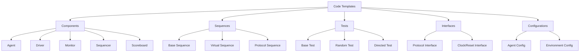

````markdown
# Code Generation Templates Guide

## Overview

This guide provides SystemVerilog code generation templates for creating UVM/OVM/Saola verification components. The agent uses these templates to automatically generate complete verification environments from extracted validation document requirements.

## 1. Template Architecture

### 1.1 Template Engine Framework

```python
class CodeGenerator:
    def __init__(self, methodology='UVM', version='1.2'):
        self.methodology = methodology
        self.version = version
        self.templates = self.load_templates()
        
    def generate_or_modify_component(self, component_type, parameters, change_type='major', target_file=None):
        """Decides whether to generate a new component or modify an existing one."""
        if change_type == 'minor' and target_file:
            return self.patch_component(component_type, parameters, target_file)
        else:
            return self.generate_component(component_type, parameters)

    def generate_component(self, component_type, parameters):
        """Generates a full component from a template."""
        template = self.templates[component_type]
        return template.render(**parameters)
        
    def patch_component(self, component_type, parameters, target_file):
        """Generates a code snippet and patches it into an existing file."""
        # 'component_type' here might refer to a snippet, e.g., 'constraint_snippet'
        snippet_template = self.templates.get(f"{component_type}_snippet")
        if not snippet_template:
            return f"Error: No snippet template found for {component_type}"
            
        code_snippet = snippet_template.render(**parameters)
        
        # Pseudocode for patching the file
        # original_code = read_file(target_file)
        # patched_code = insert_snippet(original_code, code_snippet, parameters['insertion_point'])
        # write_file(target_file, patched_code)
        return f"Component {target_file} patched with new {component_type}."

    def generate_testbench(self, architecture, components):
        # Generate complete testbench from components
        testbench_code = []
        
        for component in components:
            code = self.generate_component(component.type, component.params)
            testbench_code.append(code)
            
        return self.combine_components(testbench_code, architecture)
```

### 1.2 Template Categories



### 1.3 Modifying Existing Components

For minor changes (`VAL_DCN` indicating a modification), the agent should avoid regenerating entire files. Instead, it can use specialized "snippet" templates to generate only the required piece of code (e.g., a new constraint, a coverpoint, or a modified task) and then insert it into the appropriate location in an existing file.

**Example: Generating a Constraint Snippet**

A template for just a UVM constraint might look like this:

```systemverilog
// Template: constraint_snippet.sv
constraint {{ constraint_name }} {
  {{ constraint_body }};
}
```

The `CodeGenerator` would use this template to generate the constraint text and then a separate function would be responsible for parsing the target SystemVerilog file to find the correct class to insert it into.

```python
def patch_existing_sequence(file_path, new_constraint_params):
    """
    Generates a constraint snippet and inserts it into a sequence file.
    """
    generator = CodeGenerator()
    
    # Generate just the constraint code
    constraint_snippet = generator.generate_or_modify_component(
        component_type='constraint', 
        parameters=new_constraint_params,
        change_type='minor',
        target_file=file_path 
    )
    
    # The 'patch_component' method (called internally) would handle the file modification
    print(f"Patching {file_path} with new constraint.")
```

This approach is more efficient and less error-prone for small, targeted updates.

## 2. Component Templates

### 2.1 Generic Agent Template

```systemverilog
// Template: generic_agent.sv
class {{ agent_name }}_agent extends uvm_agent;
  `uvm_component_utils({{ agent_name }}_agent)
  
  // Agent components

  {{ agent_name }}_driver driver;


  {{ agent_name }}_monitor monitor;


  {{ agent_name }}_sequencer sequencer;

  
  // Configuration object
  {{ agent_name }}_agent_config cfg;
  
  // Protocol-specific configuration
  {{ protocol_type }}_config protocol_cfg;
  
  function new(string name = "{{ agent_name }}_agent", uvm_component parent = null);
    super.new(name, parent);
  endfunction : new
  
  virtual function void build_phase(uvm_phase phase);
    super.build_phase(phase);
    
    // Get configuration
    if (!uvm_config_db#({{ agent_name }}_agent_config)::get(this, "", "config", cfg)) begin
      `uvm_error("CONFIG", "{{ agent_name }}_agent_config not found")
    end
    
    // Get protocol configuration
    if (!uvm_config_db#({{ protocol_type }}_config)::get(this, "", "protocol_cfg", protocol_cfg)) begin
      `uvm_info("CONFIG", "Using default {{ protocol_type }} configuration", UVM_LOW)
      protocol_cfg = {{ protocol_type }}_config::type_id::create("protocol_cfg");
    end
    
    // Create components based on configuration

    monitor = {{ agent_name }}_monitor::type_id::create("monitor", this);

    
    if (cfg.is_active == UVM_ACTIVE) begin

      driver = {{ agent_name }}_driver::type_id::create("driver", this);


      sequencer = create_sequencer_by_protocol(protocol_cfg.protocol_type);

    end
  endfunction : build_phase
  
  virtual function void connect_phase(uvm_phase phase);
    super.connect_phase(phase);
    
    if (cfg.is_active == UVM_ACTIVE) begin

      driver.seq_item_port.connect(sequencer.seq_item_export);

    end
  endfunction : connect_phase
  
  // Protocol-specific sequencer creation
  virtual function {{ agent_name }}_sequencer create_sequencer_by_protocol(string protocol_type);
    case (protocol_type.tolower())

      "{{ protocol.name }}": return {{ protocol.sequencer_type }}::type_id::create("sequencer", this);

      default: return {{ agent_name }}_sequencer::type_id::create("sequencer", this);
    endcase
  endfunction : create_sequencer_by_protocol
  
endclass : {{ agent_name }}_agent
```

### 2.2 UVM Driver Template

```systemverilog
// Template: uvm_driver.sv
class {{ driver_name }}_driver extends uvm_driver#({{ transaction_type }});
  `uvm_component_utils({{ driver_name }}_driver)
  
  // Virtual interface
  virtual {{ interface_name }}_if vif;
  
  // Configuration
  {{ driver_name }}_config cfg;
  
  function new(string name = "{{ driver_name }}_driver", uvm_component parent = null);
    super.new(name, parent);
  endfunction : new
  
  virtual function void build_phase(uvm_phase phase);
    super.build_phase(phase);
    
    // Get virtual interface
    if (!uvm_config_db#(virtual {{ interface_name }}_if)::get(this, "", "vif", vif)) begin
      `uvm_fatal("VIF", "Virtual interface not found")
    end
    
    // Get configuration
    if (!uvm_config_db#({{ driver_name }}_config)::get(this, "", "config", cfg)) begin
      cfg = {{ driver_name }}_config::type_id::create("cfg");
    end
  endfunction : build_phase
  
  virtual task run_phase(uvm_phase phase);
    {{ transaction_type }} tx;
    
    // Wait for reset deassertion
    wait_for_reset();
    
    forever begin
      // Get next transaction
      seq_item_port.get_next_item(tx);
      
      // Drive transaction
      drive_transaction(tx);
      
      // Signal completion
      seq_item_port.item_done();
    end
  endtask : run_phase
  
  virtual task wait_for_reset();
    @(posedge vif.rst_n);
    @(vif.driver_cb);
  endtask : wait_for_reset
  
  virtual task drive_transaction({{ transaction_type }} tx);
    `uvm_info("DRIVER", $sformatf("Driving transaction:\n%s", tx.sprint()), UVM_HIGH)
    

    // Drive {{ signal_group.description }}
    drive_{{ signal_group.name }}(tx);

  endtask : drive_transaction
  

  virtual task drive_{{ signal_group.name }}({{ transaction_type }} tx);
    // {{ signal_group.description }}

    vif.driver_cb.{{ signal.name }} <= tx.{{ signal.field }};

    @(vif.driver_cb);
  endtask : drive_{{ signal_group.name }}

  
endclass : {{ driver_name }}_driver
```

### 2.3 UVM Monitor Template

```systemverilog
// Template: uvm_monitor.sv
class {{ monitor_name }}_monitor extends uvm_monitor;
  `uvm_component_utils({{ monitor_name }}_monitor)
  
  // Virtual interface
  virtual {{ interface_name }}_if vif;
  
  // Analysis port
  uvm_analysis_port#({{ transaction_type }}) analysis_port;
  
  // Configuration
  {{ monitor_name }}_config cfg;
  

  // Protocol checker
  {{ protocol_name }}_checker protocol_checker;

  
  function new(string name = "{{ monitor_name }}_monitor", uvm_component parent = null);
    super.new(name, parent);
    analysis_port = new("analysis_port", this);
  endfunction : new
  
  virtual function void build_phase(uvm_phase phase);
    super.build_phase(phase);
    
    // Get virtual interface
    if (!uvm_config_db#(virtual {{ interface_name }}_if)::get(this, "", "vif", vif)) begin
      `uvm_fatal("VIF", "Virtual interface not found")
    end
    
    // Get configuration
    if (!uvm_config_db#({{ monitor_name }}_config)::get(this, "", "config", cfg)) begin
      cfg = {{ monitor_name }}_config::type_id::create("cfg");
    end
    

    // Create protocol checker
    if (cfg.enable_protocol_checking) begin
      protocol_checker = {{ protocol_name }}_checker::type_id::create("protocol_checker", this);
    end

  endfunction : build_phase
  
  virtual task run_phase(uvm_phase phase);
    {{ transaction_type }} tx;
    
    // Wait for reset deassertion
    wait_for_reset();
    
    forever begin
      // Collect transaction
      collect_transaction(tx);
      

      // Protocol checking
      if (cfg.enable_protocol_checking) begin
        protocol_checker.check_transaction(tx);
      end

      
      // Send to analysis port
      analysis_port.write(tx);
    end
  endtask : run_phase
  
  virtual task wait_for_reset();
    @(posedge vif.rst_n);
    @(vif.monitor_cb);
  endtask : wait_for_reset
  
  virtual task collect_transaction(output {{ transaction_type }} tx);
    tx = {{ transaction_type }}::type_id::create("tx");
    
    // Wait for transaction start
    wait_for_transaction_start();
    

    // Collect {{ signal_group.description }}
    collect_{{ signal_group.name }}(tx);

    
    `uvm_info("MONITOR", $sformatf("Collected transaction:\n%s", tx.sprint()), UVM_HIGH)
  endtask : collect_transaction
  
  virtual task wait_for_transaction_start();

    {{ start_condition }};

    @(vif.monitor_cb);

  endtask : wait_for_transaction_start
  

  virtual task collect_{{ signal_group.name }}({{ transaction_type }} tx);
    // {{ signal_group.description }}

    tx.{{ signal.field }} = vif.monitor_cb.{{ signal.name }};

  endtask : collect_{{ signal_group.name }}

  
endclass : {{ monitor_name }}_monitor
```

### 2.4 UVM Scoreboard Template

```systemverilog
// Template: uvm_scoreboard.sv
class {{ scoreboard_name }}_scoreboard extends uvm_scoreboard;
  `uvm_component_utils({{ scoreboard_name }}_scoreboard)
  

  // Analysis port for {{ port.description }}
  uvm_analysis_imp_{{ port.name }}#({{ port.transaction_type }}, {{ scoreboard_name }}_scoreboard) {{ port.name }}_export;

  
  // Expected/Actual transaction queues

  {{ queue.transaction_type }} {{ queue.name }}_queue[$];

  
  // Statistics
  int transactions_compared;
  int transactions_passed;
  int transactions_failed;
  
  function new(string name = "{{ scoreboard_name }}_scoreboard", uvm_component parent = null);
    super.new(name, parent);

    {{ port.name }}_export = new("{{ port.name }}_export", this);

  endfunction : new
  

  virtual function void write_{{ port.name }}({{ port.transaction_type }} tx);
    `uvm_info("SCOREBOARD", $sformatf("Received {{ port.description }} transaction:\n%s", tx.sprint()), UVM_HIGH)
    
    
    // Add to expected queue
    {{ port.queue_name }}_queue.push_back(tx);
    
    // Compare with expected
    compare_{{ port.name }}(tx);
    
  endfunction : write_{{ port.name }}

  

  virtual function void compare_{{ comparator.name }}({{ comparator.transaction_type }} actual_tx);
    {{ comparator.transaction_type }} expected_tx;
    
    if ({{ comparator.expected_queue }}_queue.size() == 0) begin
      `uvm_error("SCOREBOARD", "No expected transaction for comparison")
      transactions_failed++;
      return;
    end
    
    expected_tx = {{ comparator.expected_queue }}_queue.pop_front();
    transactions_compared++;
    
    if (actual_tx.compare(expected_tx)) begin
      `uvm_info("SCOREBOARD", "Transaction comparison PASSED", UVM_MEDIUM)
      transactions_passed++;
    end else begin
      `uvm_error("SCOREBOARD", $sformatf(
        "Transaction comparison FAILED\nExpected:\n%s\nActual:\n%s",
        expected_tx.sprint(), actual_tx.sprint()))
      transactions_failed++;
    end
  endfunction : compare_{{ comparator.name }}

  
  virtual function void report_phase(uvm_phase phase);
    super.report_phase(phase);
    
    `uvm_info("SCOREBOARD", $sformatf(
      "\n=== Scoreboard Summary ===\n" +
      "Transactions Compared: %0d\n" +
      "Transactions Passed:   %0d\n" +
      "Transactions Failed:   %0d\n" +
      "Pass Rate:            %0.2f%%",
      transactions_compared,
      transactions_passed,
      transactions_failed,
      transactions_compared > 0 ? (real'(transactions_passed)/real'(transactions_compared))*100.0 : 0.0
    ), UVM_LOW)
    
    if (transactions_failed > 0) begin
      `uvm_error("SCOREBOARD", "Test failed due to transaction mismatches")
    end
  endfunction : report_phase
  
endclass : {{ scoreboard_name }}_scoreboard
```

## 3. Sequence Templates

### 3.1 Base Sequence Template

```systemverilog
// Template: base_sequence.sv
class {{ sequence_name }}_seq extends uvm_sequence#({{ transaction_type }});
  `uvm_object_utils({{ sequence_name }}_seq)
  
  // Sequence parameters

  {{ param.type }} {{ param.name }} = {{ param.default }};

  
  function new(string name = "{{ sequence_name }}_seq");
    super.new(name);
  endfunction : new
  
  virtual task pre_body();
    super.pre_body();
    
    if (starting_phase != null) begin
      starting_phase.raise_objection(this, $sformatf("%s objection raised", get_name()));
    end
  endtask : pre_body
  
  virtual task post_body();
    super.post_body();
    
    if (starting_phase != null) begin
      starting_phase.drop_objection(this, $sformatf("%s objection dropped", get_name()));
    end
  endtask : post_body
  
  virtual task body();
    `uvm_info("SEQUENCE", $sformatf("Starting %s", get_name()), UVM_MEDIUM)
    

    repeat (num_transactions) begin
      `uvm_do(req)
    end


    // {{ transaction.description }}
    `uvm_create(req)

    req.{{ field.name }} = {{ field.value }};

    `uvm_send(req)


    repeat (num_transactions) begin
      `uvm_create(req)
      assert(req.randomize() with {

        {{ constraint }};

      });
      `uvm_send(req)
    end

    
    `uvm_info("SEQUENCE", $sformatf("Completed %s", get_name()), UVM_MEDIUM)
  endtask : body
  
endclass : {{ sequence_name }}_seq
```

### 3.2 Virtual Sequence Template

```systemverilog
// Template: virtual_sequence.sv
class {{ vseq_name }}_vseq extends uvm_sequence;
  `uvm_object_utils({{ vseq_name }}_vseq)
  
  // Virtual sequencer handle
  {{ vseqr_type }} vseqr;
  
  // Sub-sequences

  {{ subsequence.type }} {{ subsequence.name }};

  
  function new(string name = "{{ vseq_name }}_vseq");
    super.new(name);
  endfunction : new
  
  virtual task pre_body();
    super.pre_body();
    
    if ($cast(vseqr, m_sequencer) == 0) begin
      `uvm_fatal("VSEQ", "Virtual sequencer cast failed")
    end
    
    if (starting_phase != null) begin
      starting_phase.raise_objection(this, $sformatf("%s objection raised", get_name()));
    end
  endtask : pre_body
  
  virtual task post_body();
    super.post_body();
    
    if (starting_phase != null) begin
      starting_phase.drop_objection(this, $sformatf("%s objection dropped", get_name()));
    end
  endtask : post_body
  
  virtual task body();
    `uvm_info("VSEQ", $sformatf("Starting %s", get_name()), UVM_MEDIUM)
    
    // Create sub-sequences

    {{ subsequence.name }} = {{ subsequence.type }}::type_id::create("{{ subsequence.name }}");

    

    // Execute sequences in parallel
    fork

      {{ subsequence.name }}.start(vseqr.{{ subsequence.sequencer }});

    join

    // Execute sequences sequentially

    {{ subsequence.name }}.start(vseqr.{{ subsequence.sequencer }});


    // Execute sequences with synchronization
    fork

      begin


        wait({{ event }});


        {{ subsequence.name }}.start(vseqr.{{ subsequence.sequencer }});


        ->{{ event }};


      end

    join

    
    `uvm_info("VSEQ", $sformatf("Completed %s", get_name()), UVM_MEDIUM)
  endtask : body
  
endclass : {{ vseq_name }}_vseq
```

## 4. Interface Templates

### 4.1 Protocol Interface Template

```systemverilog
// Template: protocol_interface.sv
interface {{ interface_name }}_if (
  input logic clk,
  input logic rst_n
);
  
  // Protocol signals

  logic [{{ signal.width-1 }}:0] {{ signal.name }};

  

  // AXI4 write address channel
  logic [31:0] awaddr;
  logic [7:0]  awlen;
  logic [2:0]  awsize;
  logic [1:0]  awburst;
  logic        awvalid;
  logic        awready;
  
  // AXI4 write data channel
  logic [31:0] wdata;
  logic [3:0]  wstrb;
  logic        wlast;
  logic        wvalid;
  logic        wready;
  
  // AXI4 write response channel
  logic [1:0]  bresp;
  logic        bvalid;
  logic        bready;
  
  // AXI4 read address channel
  logic [31:0] araddr;
  logic [7:0]  arlen;
  logic [2:0]  arsize;
  logic [1:0]  arburst;
  logic        arvalid;
  logic        arready;
  
  // AXI4 read data channel
  logic [31:0] rdata;
  logic [1:0]  rresp;
  logic        rlast;
  logic        rvalid;
  logic        rready;

  
  // Clocking blocks
  clocking driver_cb @(posedge clk);
    default input #1step output #1ns;

    output {{ signal.name }};
    input {{ signal.name }};

  endclocking : driver_cb
  
  clocking monitor_cb @(posedge clk);
    default input #1step;

    input {{ signal.name }};

  endclocking : monitor_cb
  
  // Modports
  modport driver_mp(
    clocking driver_cb,
    input clk,
    input rst_n
  );
  
  modport monitor_mp(
    clocking monitor_cb,
    input clk,
    input rst_n
  );
  
  modport dut_mp(

    outputinputinout {{ signal.name }},

  );
  

  // Protocol assertions

  {{ assertion.name }}: assert property (
    @(posedge clk) disable iff (!rst_n)
    {{ assertion.property }}
  ) else `uvm_error("ASSERTION", "{{ assertion.error_msg }}")


  

  // Interface coverage
  covergroup interface_coverage @(posedge clk);
    option.per_instance = 1;
    

    {{ coverpoint.name }}: coverpoint {{ coverpoint.signal }} {

      bins {{ bin.name }} = {{ bin.value }};

    }

  endgroup : interface_coverage
  
  interface_coverage cov_inst = new();

  
endinterface : {{ interface_name }}_if
```

## 5. Test Templates

### 5.1 Base Test Template

```systemverilog
// Template: base_test.sv
class {{ test_name }}_test extends uvm_test;
  `uvm_component_utils({{ test_name }}_test)
  
  // Test environment
  {{ env_type }} env;
  
  // Test configuration
  {{ config_type }} cfg;
  
  function new(string name = "{{ test_name }}_test", uvm_component parent = null);
    super.new(name, parent);
  endfunction : new
  
  virtual function void build_phase(uvm_phase phase);
    super.build_phase(phase);
    
    // Create configuration
    cfg = {{ config_type }}::type_id::create("cfg");
    configure_test(cfg);
    
    // Set configuration in database
    uvm_config_db#({{ config_type }})::set(this, "*", "config", cfg);
    
    // Create environment
    env = {{ env_type }}::type_id::create("env", this);
  endfunction : build_phase
  
  virtual function void configure_test({{ config_type }} cfg);

    cfg.{{ config_item.name }} = {{ config_item.value }};

    

    // Factory overrides

    {{ override.base_type }}::type_id::set_type_override({{ override.override_type }}::get_type());


  endfunction : configure_test
  
  virtual task run_phase(uvm_phase phase);
    {{ vseq_type }} vseq;
    
    phase.raise_objection(this, "Test running");
    
    // Create and start virtual sequence
    vseq = {{ vseq_type }}::type_id::create("vseq");
    configure_sequence(vseq);
    vseq.start(env.vseqr);
    
    phase.drop_objection(this, "Test completed");
  endtask : run_phase
  
  virtual function void configure_sequence({{ vseq_type }} vseq);

    vseq.{{ seq_config.name }} = {{ seq_config.value }};

  endfunction : configure_sequence
  
  virtual function void end_of_elaboration_phase(uvm_phase phase);
    super.end_of_elaboration_phase(phase);
    uvm_top.print_topology();
  endfunction : end_of_elaboration_phase
  
endclass : {{ test_name }}_test
```

## 6. Configuration Templates

### 6.1 Agent Configuration Template

```systemverilog
// Template: agent_config.sv
class {{ agent_name }}_agent_config extends uvm_object;
  `uvm_object_utils({{ agent_name }}_agent_config)
  
  // Agent configuration
  uvm_active_passive_enum is_active = UVM_ACTIVE;
  
  // Component enables
  bit has_driver = 1;
  bit has_monitor = 1;
  bit has_sequencer = 1;
  bit has_coverage = 1;
  
  // Protocol configuration

  {{ config_param.type }} {{ config_param.name }} = {{ config_param.default }};

  
  // Timing configuration
  time setup_time = 1ns;
  time hold_time = 1ns;
  
  // Coverage configuration
  bit enable_functional_coverage = 1;
  bit enable_protocol_checking = 1;
  
  function new(string name = "{{ agent_name }}_agent_config");
    super.new(name);
  endfunction : new
  
  virtual function void configure_for_protocol(string protocol_name);
    case (protocol_name)

      "{{ protocol.name }}": configure_{{ protocol.name }}();

      default: `uvm_warning("CONFIG", $sformatf("Unknown protocol: %s", protocol_name))
    endcase
  endfunction : configure_for_protocol
  

  virtual function void configure_{{ protocol.name }}();

    {{ param.name }} = {{ param.value }};

  endfunction : configure_{{ protocol.name }}

  
endclass : {{ agent_name }}_agent_config
```

## 7. Transaction Templates

### 7.1 Protocol Transaction Template

```systemverilog
// Template: protocol_transaction.sv
class {{ transaction_name }} extends uvm_sequence_item;
  `uvm_object_utils({{ transaction_name }})
  
  // Transaction fields

  rand {{ field.type }} {{ field.name }} = {{ field.default }};

  
  // Constraints

  constraint {{ constraint.name }} {
    {{ constraint.expression }};
  }

  
  function new(string name = "{{ transaction_name }}");
    super.new(name);
  endfunction : new
  
  virtual function void do_copy(uvm_object rhs);
    {{ transaction_name }} rhs_tx;
    
    if (!$cast(rhs_tx, rhs)) begin
      `uvm_fatal("COPY", "Cast failed")
    end
    
    super.do_copy(rhs);
    

    this.{{ field.name }} = rhs_tx.{{ field.name }};

  endfunction : do_copy
  
  virtual function bit do_compare(uvm_object rhs, uvm_comparer comparer);
    {{ transaction_name }} rhs_tx;
    bit result;
    
    if (!$cast(rhs_tx, rhs)) begin
      return 0;
    end
    
    result = super.do_compare(rhs, comparer);
    

    result &= comparer.compare_field("{{ field.name }}", this.{{ field.name }}, rhs_tx.{{ field.name }}, $bits(this.{{ field.name }}));

    
    return result;
  endfunction : do_compare
  
  virtual function string convert2string();
    string s;
    
    $sformat(s, "%s:\n", get_name());

    $sformat(s, "%s  {{ field.name }} = %0{{ 'h' if field.radix == 'hex' else 'd' }}\n", s, {{ field.name }});

    
    return s;
  endfunction : convert2string
  


  virtual function {{ method.return_type }} {{ method.name }}({{ method.parameters }});
    // {{ method.description }}
    {{ method.body }}
  endfunction : {{ method.name }}


  
endclass : {{ transaction_name }}
```

## 8. Methodology-Specific Templates

### 8.1 OVM Templates

```systemverilog
// OVM Agent Template
class {{ agent_name }}_agent extends ovm_agent;
  `ovm_component_utils({{ agent_name }}_agent)
  
  // OVM-specific implementation
  {{ agent_name }}_driver driver;
  {{ agent_name }}_monitor monitor;
  {{ agent_name }}_sequencer sequencer;
  
  function new(string name, ovm_component parent);
    super.new(name, parent);
  endfunction
  
  virtual function void build();
    super.build();
    
    monitor = {{ agent_name }}_monitor::type_id::create("monitor", this);
    
    if (is_active == OVM_ACTIVE) begin
      driver = {{ agent_name }}_driver::type_id::create("driver", this);
      sequencer = {{ agent_name }}_sequencer::type_id::create("sequencer", this);
    end
  endfunction
endclass
```

### 8.2 Saola Templates

```systemverilog
// Saola BFM Integration Template
class {{ bfm_name }}_wrapper;
  // Saola BFM instance
  {{ bfm_type }} bfm_inst;
  
  // UVM analysis port
````