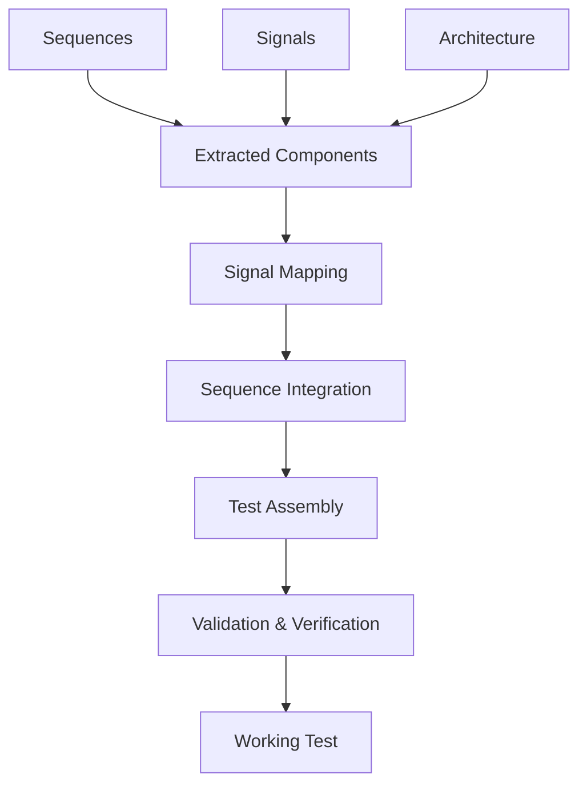

# Integration Guide: Combining Sequences and Signals

## Overview

This guide describes how to integrate extracted sequences, signals, and test structures into a working UVM/OVM/Saola test environment. The agent must orchestrate the combination of these elements to create functional verification tests.

## 1. Integration Architecture

### 1.1 Integration Workflow



### 1.2 Component Dependencies

```python
class TestIntegration:
    def __init__(self, sequences, signals, architecture):
        self.sequences = sequences
        self.signals = signals
        self.architecture = architecture
        self.integration_map = self.create_integration_map()
    
    def create_integration_map(self):
        return {
            'interface_bindings': self.map_signals_to_interfaces(),
            'sequence_assignments': self.assign_sequences_to_agents(),
            'timing_relationships': self.establish_timing_constraints(),
            'data_flow': self.map_data_dependencies()
        }
```

## 2. Signal-to-Interface Mapping

### 2.1 Interface Generation

**UVM Interface Template**:
```systemverilog
interface {interface_name}_if (input logic clk, input logic rst_n);
  // Signal declarations

  logic [{{ signal.width-1 }}:0] {{ signal.name }};

  
  // Clocking blocks
  clocking driver_cb @(posedge clk);
    default input #1step output #1ns;

    output {{ signal.name }};


    input {{ signal.name }};

  endclocking
  
  clocking monitor_cb @(posedge clk);
    default input #1step;

    input {{ signal.name }};

  endclocking
  
  modport driver_mp(clocking driver_cb, input clk, input rst_n);
  modport monitor_mp(clocking monitor_cb, input clk, input rst_n);
  modport dut_mp(

    outputinput {{ signal.name }},

  );
endinterface
```

### 2.2 Protocol-Agnostic Integration

#### Generic Protocol Integration
```python
def integrate_protocol_signals(signals, sequences, protocol_type):
    protocol_handlers = {
        'axi4': integrate_axi4_signals,
        'pcie': integrate_pcie_signals,
        'uart': integrate_uart_signals,
        'spi': integrate_spi_signals,
        'i2c': integrate_i2c_signals,
        'custom': integrate_custom_signals
    }
    
    handler = protocol_handlers.get(protocol_type.lower(), integrate_custom_signals)
    return handler(signals, sequences)

def integrate_axi4_signals(signals, sequences):
    axi_channels = {
        'write_address': ['awaddr', 'awlen', 'awsize', 'awburst', 'awvalid', 'awready'],
        'write_data': ['wdata', 'wstrb', 'wlast', 'wvalid', 'wready'],
        'write_response': ['bresp', 'bvalid', 'bready'],
        'read_address': ['araddr', 'arlen', 'arsize', 'arburst', 'arvalid', 'arready'],
        'read_data': ['rdata', 'rresp', 'rlast', 'rvalid', 'rready']
    }
    
    return create_channel_integration(signals, sequences, axi_channels)

def integrate_pcie_signals(signals, sequences):
    pcie_layers = {
        'transaction': ['req_', 'cpl_', 'msg_'],
        'datalink': ['dll_', 'dllp_', 'lcrc_'],
        'physical': ['rx_', 'tx_', 'pipe_', 'ltssm_']
    }
    
    return create_layered_integration(signals, sequences, pcie_layers)

def integrate_custom_signals(signals, sequences):
    """Generic integration for custom protocols"""
    generic_groups = {
        'control': ['valid', 'ready', 'enable', 'start', 'stop'],
        'data': ['data', 'addr', 'payload'],
        'status': ['ack', 'error', 'status', 'done'],
        'clock_reset': ['clk', 'clock', 'rst', 'reset']
    }
    
    return create_generic_integration(signals, sequences, generic_groups)
```

## 3. Sequence Integration

### 3.1 Sequence Orchestration

**UVM Virtual Sequence Pattern**:
```systemverilog
class {test_name}_vseq extends uvm_sequence;
  `uvm_object_utils({test_name}_vseq)
  
  // Sequence handles

  {{ sequence.class }} {{ sequence.name }}_h;

  
  // Virtual sequencer handle
  {test_name}_vsequencer vseqr;
  
  function new(string name = "{test_name}_vseq");
    super.new(name);
  endfunction
  
  virtual task body();
    // Initialize sequences

    {{ sequence.name }}_h = {{ sequence.class }}::type_id::create("{{ sequence.name }}_h");

    
    // Execute sequence orchestration
    fork

      begin
        {{ sequence.name }}_h.start(vseqr.{{ get_sequencer_name(sequence) }});
      end

    join
  endtask
endclass
```

### 3.2 Sequence Synchronization

**Event-Based Synchronization**:
```systemverilog
class synchronized_sequence extends uvm_sequence;
  uvm_event_pool event_pool;
  
  virtual task body();
    event_pool = uvm_event_pool::get_global_pool();
    
    // Wait for prerequisite events

    event_pool.get("{{ prereq }}").wait_on();

    
    // Execute sequence logic
    execute_sequence_body();
    
    // Signal completion events

    event_pool.get("{{ completion }}").trigger();

  endtask
endclass
```

**Phase-Based Synchronization**:
```systemverilog
class phased_sequence extends uvm_sequence;
  virtual task pre_body();
    // Pre-sequence setup
    setup_phase_synchronization();
  endtask
  
  virtual task body();
    // Main sequence execution
    case (get_current_phase())
      "reset_phase": execute_reset_sequence();
      "config_phase": execute_config_sequence();
      "main_phase": execute_main_sequence();
      "drain_phase": execute_drain_sequence();
    endcase
  endtask
endclass
```

## 4. Agent and Component Integration

### 4.1 Agent Configuration

```systemverilog
class {agent_name}_config extends uvm_object;
  `uvm_object_utils({agent_name}_config)
  
  // Agent configuration
  uvm_active_passive_enum is_active = UVM_ACTIVE;
  bit has_driver = 1;
  bit has_monitor = 1;
  bit has_sequencer = 1;
  
  // Interface configuration

  virtual {{ interface.name }}_if {{ interface.name }}_vif;

  
  // Protocol-specific configuration

  {{ param.type }} {{ param.name }} = {{ param.default }};

  
  function new(string name = "{agent_name}_config");
    super.new(name);
  endfunction
endclass
```

### 4.2 Environment Assembly

```systemverilog
class {test_name}_env extends uvm_env;
  `uvm_component_utils({test_name}_env)
  
  // Agent instances

  {{ agent.type }} {{ agent.name }};

  
  // Scoreboard and other components
  {test_name}_scoreboard sb;
  {test_name}_coverage cov;
  
  function new(string name = "{test_name}_env", uvm_component parent = null);
    super.new(name, parent);
  endfunction
  
  virtual function void build_phase(uvm_phase phase);
    super.build_phase(phase);
    
    // Create agents

    {{ agent.name }} = {{ agent.type }}::type_id::create("{{ agent.name }}", this);

    
    // Create other components
    sb = {test_name}_scoreboard::type_id::create("sb", this);
    cov = {test_name}_coverage::type_id::create("cov", this);
  endfunction
  
  virtual function void connect_phase(uvm_phase phase);
    super.connect_phase(phase);
    
    // Connect analysis ports

    {{ connection.source }}.{{ connection.port }}.connect({{ connection.destination }}.{{ connection.port }});

  endfunction
endclass
```

## 5. Test Execution Flow

### 5.1 Test Phase Management

```systemverilog
class {test_name}_test extends uvm_test;
  `uvm_component_utils({test_name}_test)
  
  {test_name}_env env;
  {test_name}_config cfg;
  
  virtual function void build_phase(uvm_phase phase);
    super.build_phase(phase);
    
    // Create configuration
    cfg = {test_name}_config::type_id::create("cfg");
    configure_test_parameters(cfg);
    uvm_config_db#({test_name}_config)::set(this, "*", "config", cfg);
    
    // Create environment
    env = {test_name}_env::type_id::create("env", this);
  endfunction
  
  virtual task run_phase(uvm_phase phase);
    {test_name}_vseq vseq;
    
    phase.raise_objection(this);
    
    // Execute virtual sequence
    vseq = {test_name}_vseq::type_id::create("vseq");
    vseq.start(env.vseqr);
    
    phase.drop_objection(this);
  endtask
endclass
```

### 5.2 Timing and Synchronization

**Clock Domain Management**:
```systemverilog
class clock_domain_manager;
  typedef struct {
    real frequency;
    real duty_cycle;
    time start_delay;
  } clock_config_t;
  
  clock_config_t clock_configs[string];
  
  function void configure_clocks();

    clock_configs["{{ clock.name }}"] = '{
      frequency: {{ clock.frequency }},
      duty_cycle: {{ clock.duty_cycle }},
      start_delay: {{ clock.start_delay }}
    };

  endfunction
endclass
```

**Reset Management**:
```systemverilog
virtual task reset_phase(uvm_phase phase);
  super.reset_phase(phase);
  
  fork

    begin
      {{ reset.interface }}.{{ reset.signal }} <= {{ reset.active_level }};
      #{{ reset.duration }};
      {{ reset.interface }}.{{ reset.signal }} <= {{ reset.inactive_level }};
    end

  join
endtask
```

## 6. Data Flow Integration

### 6.1 Transaction Mapping

```systemverilog
class {protocol}_transaction extends uvm_sequence_item;
  `uvm_object_utils({protocol}_transaction)
  
  // Transaction fields mapped from signals

  rand {{ signal.type }} {{ signal.name }};

  
  // Constraints from sequence parameters

  constraint {{ constraint.name }} {
    {{ constraint.expression }};
  }

  
  function new(string name = "{protocol}_transaction");
    super.new(name);
  endfunction
endclass
```

### 6.2 Stimulus Generation

```systemverilog
class {protocol}_driver extends uvm_driver#({protocol}_transaction);
  virtual {interface_name}_if vif;
  
  virtual task drive_transaction({protocol}_transaction tx);
    // Map transaction fields to interface signals

    vif.driver_cb.{{ mapping.signal }} <= tx.{{ mapping.field }};

    
    // Apply protocol-specific timing
    apply_protocol_timing(tx);
  endtask
endclass
```

## 7. Integration Validation

### 7.1 Connectivity Checks

```python
def validate_integration(test_components):
    validation_results = {
        'connectivity': check_connectivity(test_components),
        'timing': validate_timing_constraints(test_components),
        'protocol_compliance': check_protocol_compliance(test_components),
        'coverage': validate_coverage_points(test_components)
    }
    
    return validation_results

def check_connectivity(components):
    errors = []
    
    # Check all interfaces are connected
    for interface in components['interfaces']:
        if not has_driver_connection(interface):
            errors.append(f"Interface {interface.name} missing driver connection")
        if not has_monitor_connection(interface):
            errors.append(f"Interface {interface.name} missing monitor connection")
    
    return errors
```

### 7.2 Integration Testing

```systemverilog
class integration_test extends uvm_test;
  virtual task run_phase(uvm_phase phase);
    phase.raise_objection(this);
    
    // Test basic connectivity
    test_interface_connectivity();
    
    // Test sequence execution
    test_sequence_execution();
    
    // Test data flow
    test_data_flow();
    
    phase.drop_objection(this);
  endtask
endclass
```

## 8. Methodology-Specific Integration

### 8.1 UVM-Specific Features

- **Factory Pattern**: Use UVM factory for component creation
- **Configuration Database**: Centralized configuration management
- **Analysis Ports**: For monitoring and coverage collection
- **Objection Mechanism**: Phase control and synchronization

### 8.2 OVM-Specific Features

- **Legacy Component Structure**: Adapt to OVM component hierarchy
- **OVM Macros**: Use appropriate OVM utility macros
- **Phase Methods**: Implement OVM phase methods

### 8.3 Saola-Specific Features

- **BFM Integration**: Saola Bus Functional Models
- **Test Manager**: Saola test execution framework
- **Signal Groups**: Saola signal grouping mechanisms

## Best Practices

1. **Modular Design**: Keep components loosely coupled
2. **Configuration Management**: Use centralized configuration
3. **Error Handling**: Implement robust error checking
4. **Documentation**: Maintain integration documentation
5. **Validation**: Thoroughly test integrated components
6. **Reusability**: Design for component reuse

---

*Next: [03-coverage-implementation.md](03-coverage-implementation.md) - Learn how to implement comprehensive coverage*