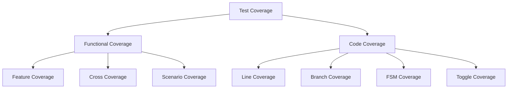

# Coverage Implementation Guide

## Overview

This guide describes how to implement comprehensive coverage for UVM/OVM/Saola tests based on extracted validation document requirements. The agent must generate both functional and code coverage to ensure thorough verification.

## 1. Coverage Architecture

### 1.1 Coverage Hierarchy



### 1.2 Coverage Integration Framework

```systemverilog
class {test_name}_coverage extends uvm_subscriber#({transaction_type});
  `uvm_component_utils({test_name}_coverage)
  
  // Coverage models

  {{ covergroup.name }}_cg {{ covergroup.name }};

  
  // Coverage configuration
  coverage_config_t cfg;
  
  function new(string name = "{test_name}_coverage", uvm_component parent = null);
    super.new(name, parent);
    
    // Initialize coverage groups

    {{ covergroup.name }} = new();

  endfunction
  
  virtual function void write({transaction_type} t);
    // Sample all coverage groups

    {{ covergroup.name }}.sample(t);

  endfunction
endclass
```

## 2. Functional Coverage Implementation

### 2.1 Generic Feature Coverage Extraction

**From Validation Document**:
```markdown
## Coverage Requirements for {{ protocol_name }}

### Protocol Features

- **Burst Types**: INCR, WRAP, FIXED
- **Transfer Sizes**: 1, 2, 4, 8, 16 bytes
- **Address Alignment**: Aligned, Unaligned

- **TLP Types**: Memory Read/Write, Configuration, Message
- **Packet Sizes**: 1DW, 2DW, 3DW, 4DW
- **Link States**: L0, L0s, L1, L2

- **Baud Rates**: 9600, 19200, 38400, 115200
- **Data Formats**: 7-bit, 8-bit with/without parity
- **Flow Control**: None, RTS/CTS, XON/XOFF

- **Custom Features**: Define based on protocol specification

- **Outstanding Transactions**: 1-16

### Data Patterns
- **Walking 1s/0s**: All bit positions
- **Random Data**: Full range
- **Corner Cases**: Min/Max values
```

**Generated Coverage Groups**:
```systemverilog
covergroup {{ protocol_name }}_features_cg @(posedge clk);

  // AXI4-specific coverage
  burst_type_cp: coverpoint transaction.burst_type {
    bins incr = {AXI4_INCR};
    bins wrap = {AXI4_WRAP};
    bins fixed = {AXI4_FIXED};
  }
  
  transfer_size_cp: coverpoint transaction.transfer_size {
    bins size_1 = {1};
    bins size_2 = {2};
    bins size_4 = {4};
    bins size_8 = {8};
    bins size_16 = {16};
  }

  // PCIe-specific coverage
  tlp_type_cp: coverpoint transaction.tlp_type {
    bins mem_read = {MEM_READ};
    bins mem_write = {MEM_WRITE};
    bins config_read = {CONFIG_READ};
    bins config_write = {CONFIG_WRITE};
    bins message = {MESSAGE};
  }
  
  packet_size_cp: coverpoint transaction.length {
    bins small = {[1:4]};
    bins medium = {[5:64]};
    bins large = {[65:1024]};
  }

  // Generic protocol coverage
  transaction_type_cp: coverpoint transaction.trans_type {
    bins read = {READ};
    bins write = {WRITE};
    bins control = {CONTROL};
  }
  
  data_size_cp: coverpoint transaction.data_size {
    bins small = {[1:8]};
    bins medium = {[9:64]};
    bins large = {[65:256]};
  }

  
  // Common coverage points
  outstanding_cp: coverpoint outstanding_count {
    bins single = {1};
    bins few = {[2:4]};
    bins many = {[5:16]};
  }
endcovergroup
```

### 2.2 Cross Coverage Implementation

```systemverilog
covergroup cross_coverage_cg @(posedge clk);
  burst_type_cp: coverpoint transaction.burst_type;
  transfer_size_cp: coverpoint transaction.transfer_size;
  addr_alignment_cp: coverpoint (transaction.address % transaction.transfer_size);
  
  // Cross coverage between burst type and size
  burst_size_cross: cross burst_type_cp, transfer_size_cp {
    // Exclude illegal combinations
    illegal_bins illegal = binsof(burst_type_cp) intersect {WRAP} &&
                           binsof(transfer_size_cp) intersect {1};
  }
  
  // Cross coverage for alignment and size
  align_size_cross: cross addr_alignment_cp, transfer_size_cp;
  
  // Three-way cross coverage
  burst_size_align_cross: cross burst_type_cp, transfer_size_cp, addr_alignment_cp {
    option.weight = 0; // Only collect if hit
  }
endcovergroup
```

### 2.3 Scenario Coverage

```systemverilog
covergroup scenario_coverage_cg;
  // State transitions
  state_transition_cp: coverpoint current_state {
    bins idle_to_active = (IDLE => ACTIVE);
    bins active_to_idle = (ACTIVE => IDLE);
    bins active_to_error = (ACTIVE => ERROR);
    bins error_to_idle = (ERROR => IDLE);
  }
  
  // Sequence patterns
  sequence_pattern_cp: coverpoint sequence_id {

    bins {{ sequence.name }} = { {{ sequence.id }} };

  }
  
  // Error scenarios
  error_scenario_cp: coverpoint error_type {
    bins timeout = {TIMEOUT_ERROR};
    bins protocol_violation = {PROTOCOL_ERROR};
    bins data_corruption = {DATA_ERROR};
  }
endcovergroup
```

### 2.4 Dynamic Coverage Generation

```python
def generate_coverage_from_signals(signals, requirements):
    coverage_code = []
    
    for signal in signals:
        if signal.get('coverage_required'):
            coverpoint = generate_signal_coverpoint(signal, requirements)
            coverage_code.append(coverpoint)
    
    return "\n".join(coverage_code)

def generate_signal_coverpoint(signal, requirements):
    if signal['width'] == 1:
        return f"""
  {signal['name']}_cp: coverpoint {signal['name']} {{
    bins low = {{0}};
    bins high = {{1}};
  }}"""
    else:
        bins = generate_value_bins(signal, requirements)
        return f"""
  {signal['name']}_cp: coverpoint {signal['name']} {{
{bins}
  }}"""
```

## 3. Code Coverage Implementation

### 3.1 Line and Branch Coverage

**Coverage Configuration**:
```systemverilog
// Coverage configuration in testbench
initial begin
  // Enable line coverage
  $set_coverage(SV_COV_LINE, 1);
  
  // Enable branch coverage
  $set_coverage(SV_COV_BRANCH, 1);
  
  // Enable statement coverage
  $set_coverage(SV_COV_STATEMENT, 1);
  
  // Configure coverage database
  $coverage_control(CG_SET_FILE, "coverage.ucdb");
end
```

### 3.2 FSM Coverage

```systemverilog
// FSM state coverage
covergroup fsm_coverage_cg @(posedge clk);
  // State coverage
  current_state_cp: coverpoint current_state {

    bins {{ state.name }} = { {{ state.value }} };

  }
  
  // Transition coverage
  state_transition_cp: coverpoint {previous_state, current_state} {

    bins {{ transition.from }}_to_{{ transition.to }} = 
      { {{ transition.from_value }}, {{ transition.to_value }} };

  }
endcovergroup
```

### 3.3 Toggle Coverage

```systemverilog
// Toggle coverage for critical signals
generate
  for (genvar i = 0; i < NUM_CRITICAL_SIGNALS; i++) begin : toggle_cov
    covergroup signal_toggle_cg @(critical_signals[i]);
      toggle_cp: coverpoint critical_signals[i] {
        bins zero_to_one = (0 => 1);
        bins one_to_zero = (1 => 0);
      }
    endgroup
    
    signal_toggle_cg signal_toggle_inst = new();
  end
endgenerate
```

## 4. Coverage Collector Implementation

### 4.1 Monitor-Based Collection

```systemverilog
class {protocol}_monitor extends uvm_monitor;
  `uvm_component_utils({protocol}_monitor)
  
  virtual {interface_name}_if vif;
  uvm_analysis_port#({transaction_type}) analysis_port;
  
  // Coverage collector
  {protocol}_coverage coverage_collector;
  
  virtual function void build_phase(uvm_phase phase);
    super.build_phase(phase);
    analysis_port = new("analysis_port", this);
    coverage_collector = {protocol}_coverage::type_id::create("coverage_collector", this);
  endfunction
  
  virtual function void connect_phase(uvm_phase phase);
    super.connect_phase(phase);
    analysis_port.connect(coverage_collector.analysis_export);
  endfunction
  
  virtual task run_phase(uvm_phase phase);
    {transaction_type} tx;
    
    forever begin
      // Monitor interface for transactions
      monitor_transaction(tx);
      
      // Send to coverage collector
      analysis_port.write(tx);
    end
  endtask
endclass
```

### 4.2 Scoreboard-Based Collection

```systemverilog
class {test_name}_scoreboard extends uvm_scoreboard;
  `uvm_analysis_imp_decl(_observed)
  `uvm_analysis_imp_decl(_expected)
  
  uvm_analysis_imp_observed#({transaction_type}, {test_name}_scoreboard) observed_export;
  uvm_analysis_imp_expected#({transaction_type}, {test_name}_scoreboard) expected_export;
  
  // Coverage models
  protocol_coverage_cg protocol_cov;
  performance_coverage_cg performance_cov;
  
  virtual function void write_observed({transaction_type} tx);
    // Check transaction
    check_transaction(tx);
    
    // Sample coverage
    protocol_cov.sample(tx);
    performance_cov.sample(tx);
  endfunction
endclass
```

## 5. Coverage Analysis and Reporting

### 5.1 Coverage Database Management

```systemverilog
class coverage_manager;
  string coverage_db_name;
  real coverage_threshold;
  
  function new(string db_name = "test_coverage.ucdb");
    coverage_db_name = db_name;
    coverage_threshold = 95.0; // Default threshold
  endfunction
  
  virtual function void report_coverage();
    real functional_cov, code_cov, total_cov;
    
    // Get coverage percentages
    functional_cov = get_functional_coverage();
    code_cov = get_code_coverage();
    total_cov = (functional_cov + code_cov) / 2.0;
    
    // Report coverage
    `uvm_info("COVERAGE", $sformatf(
      "Coverage Report:\n" +
      "  Functional Coverage: %0.2f%%\n" +
      "  Code Coverage: %0.2f%%\n" +
      "  Total Coverage: %0.2f%%",
      functional_cov, code_cov, total_cov), UVM_LOW)
    
    // Check against threshold
    if (total_cov < coverage_threshold) begin
      `uvm_error("COVERAGE", $sformatf(
        "Coverage %0.2f%% below threshold %0.2f%%",
        total_cov, coverage_threshold))
    end
  endfunction
endclass
```

### 5.2 Coverage-Driven Test Completion

```systemverilog
class coverage_driven_test extends uvm_test;
  coverage_manager cov_mgr;
  
  virtual task run_phase(uvm_phase phase);
    phase.raise_objection(this);
    
    // Run until coverage goals are met
    while (!coverage_goals_met()) begin
      run_test_iteration();
      
      // Check coverage periodically
      if (get_simulation_time() % CHECK_INTERVAL == 0) begin
        cov_mgr.report_coverage();
      end
    end
    
    // Final coverage report
    cov_mgr.report_coverage();
    phase.drop_objection(this);
  endtask
  
  virtual function bit coverage_goals_met();
    return (get_total_coverage() >= COVERAGE_THRESHOLD);
  endfunction
endclass
```

## 6. Methodology-Specific Coverage

### 6.1 UVM Coverage Features

```systemverilog
// UVM-specific coverage subscriber
class uvm_coverage_subscriber extends uvm_subscriber#({transaction_type});
  `uvm_component_utils(uvm_coverage_subscriber)
  
  // UVM coverage model
  {protocol}_coverage_model cov_model;
  
  virtual function void write({transaction_type} t);
    // Sample UVM coverage model
    cov_model.sample(t);
    
    // Update UVM report catcher
    update_coverage_report(t);
  endfunction
endclass
```

### 6.2 OVM Coverage Features

```systemverilog
// OVM-specific coverage implementation
class ovm_coverage_collector extends ovm_component;
  `ovm_component_utils(ovm_coverage_collector)
  
  // OVM analysis export
  ovm_analysis_export#({transaction_type}) analysis_export;
  
  virtual function void write({transaction_type} tx);
    // OVM-style coverage collection
    collect_ovm_coverage(tx);
  endfunction
endclass
```

### 6.3 Saola Coverage Features

```systemverilog
// Saola-specific coverage
class sla_coverage_collector;
  // Saola coverage groups
  sla_protocol_cg protocol_cov;
  sla_performance_cg performance_cov;
  
  function void collect_coverage(sla_transaction tx);
    // Sample Saola coverage
    protocol_cov.sample(tx);
    performance_cov.sample(tx);
  endfunction
endclass
```

## 7. Coverage Optimization

### 7.1 Intelligent Sampling

```systemverilog
class intelligent_coverage_sampler;
  bit [31:0] sample_rates[string];
  bit [31:0] hit_counts[string];
  
  function void configure_sampling();
    // Higher sampling for low-hit coverage points
    foreach (hit_counts[cp]) begin
      if (hit_counts[cp] < THRESHOLD_LOW) begin
        sample_rates[cp] = 100; // 100% sampling
      end else if (hit_counts[cp] > THRESHOLD_HIGH) begin
        sample_rates[cp] = 10;  // 10% sampling
      end
    end
  endfunction
endclass
```

### 7.2 Coverage-Guided Stimulus

```systemverilog
class coverage_guided_sequence extends uvm_sequence;
  coverage_feedback_t coverage_feedback;
  
  virtual task body();
    // Analyze coverage gaps
    analyze_coverage_gaps();
    
    // Generate stimulus targeting uncovered areas
    while (has_coverage_gaps()) begin
      generate_targeted_stimulus();
      execute_stimulus();
      update_coverage_feedback();
    end
  endtask
endclass
```

## 8. Coverage Metrics and Goals

### 8.1 Coverage Metrics Definition

```python
coverage_metrics = {
    'functional_coverage': {
        'feature_coverage': {'weight': 40, 'threshold': 95},
        'cross_coverage': {'weight': 30, 'threshold': 90},
        'scenario_coverage': {'weight': 30, 'threshold': 85}
    },
    'code_coverage': {
        'line_coverage': {'weight': 25, 'threshold': 95},
        'branch_coverage': {'weight': 25, 'threshold': 90},
        'fsm_coverage': {'weight': 25, 'threshold': 100},
        'toggle_coverage': {'weight': 25, 'threshold': 80}
    }
}
```

### 8.2 Coverage Goals Verification

```systemverilog
function bit verify_coverage_goals();
  real functional_score, code_score;
  
  // Calculate weighted functional coverage
  functional_score = 
    (feature_coverage * 0.4) +
    (cross_coverage * 0.3) +
    (scenario_coverage * 0.3);
  
  // Calculate weighted code coverage
  code_score = 
    (line_coverage * 0.25) +
    (branch_coverage * 0.25) +
    (fsm_coverage * 0.25) +
    (toggle_coverage * 0.25);
  
  // Overall coverage goal
  return (functional_score >= 90.0) && (code_score >= 85.0);
endfunction
```

## Best Practices

1. **Comprehensive Planning**: Define coverage goals early
2. **Layered Approach**: Implement multiple coverage types
3. **Automated Analysis**: Use tools for coverage analysis
4. **Continuous Monitoring**: Track coverage during test execution
5. **Optimization**: Focus stimulus on coverage gaps
6. **Documentation**: Document coverage requirements and results

---

*Next: [04-architecture-patterns.md](04-architecture-patterns.md) - Learn about UVM testbench architecture patterns*