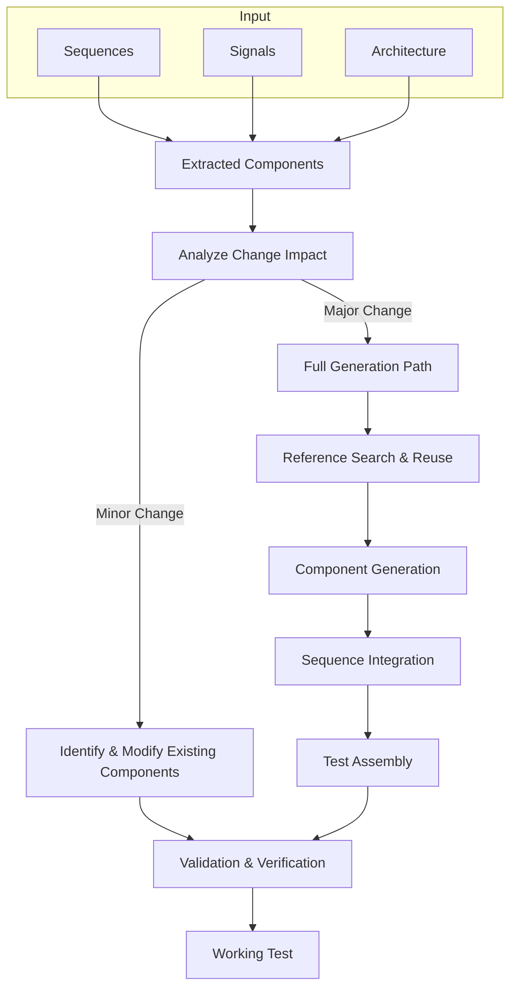

# Integration Guide: Combining Sequences and Signals

## Overview

This guide describes how to integrate extracted sequences, signals, and test structures into a working UVM/OVM/Saola test environment. The agent must orchestrate the combination of these elements to create functional verification tests.

## 1. Integration Architecture

### 1.1 Integration Workflow



### 1.2 Component Dependencies

```python
class TestIntegration:
    def __init__(self, sequences, signals, architecture, dcn_metadata):
        self.sequences = sequences
        self.signals = signals
        self.architecture = architecture
        self.dcn_metadata = dcn_metadata # Contains info about the change
        self.change_impact = self.analyze_change_impact()

    def analyze_change_impact(self):
        """Analyzes DCN to classify change as 'minor' or 'major'."""
        if self.dcn_metadata.get('is_incremental_change', False):
            return 'minor'
        # Keywords can also be used for classification
        minor_keywords = ['update', 'modify', 'add constraint', 'tweak']
        if any(kw in self.dcn_metadata.get('title', '').lower() for kw in minor_keywords):
            return 'minor'
        return 'major'

    def integrate(self):
        if self.change_impact == 'minor':
            self.apply_minor_change()
        else:
            self.execute_full_integration()

    def apply_minor_change(self):
        """Finds and patches existing files for minor changes."""
        target_sequence = self.dcn_metadata.get('target_sequence')
        if target_sequence:
            # Pseudocode for finding and patching a file
            # file_path = find_sequence_file(target_sequence)
            # patch_sequence(file_path, self.sequences)
            print(f"Applying minor change to {target_sequence}")

    def execute_full_integration(self):
        """Executes the full, generative integration workflow."""
        self.reference_components = self.find_reference_components()
        self.integration_map = self.create_integration_map()
        # ... rest of the major change workflow
```

### 1.3 Reference Component Search

Before generating new components from scratch, the agent must search the existing workspace for verification assets that can be reused or adapted. This step promotes code reuse and accelerates the verification process.

**Search Strategy**:
1.  **Identify Keywords**: Use keywords from the extracted components, such as protocol names (`AXI`, `PCIe`, `FIFO`), component types (`driver`, `monitor`, `agent`), and interface names.
2.  **Filter by File Type**: Limit the search to verification-specific file extensions, such as `.sv`, `.svh`, `*_pkg.sv`, `*_test.sv`, and `Makefile` or script files related to simulation. Avoid searching within RTL directories (`rtl/`, `src/`).
3.  **Analyze Findings**: If relevant files are found, the agent should analyze them to determine if they can be integrated directly or used as a template.

```python
def find_reusable_verification_files(keywords):
    """
    Searches the workspace for verification files matching a set of keywords.
    The search is focused on non-RTL directories.
    """
    reusable_assets = {}
    # Example: Search for files like 'axi_driver.sv', 'pcie_agent_pkg.sv', etc.
    # This would be a call to a file search tool.
    search_results = workspace.find_files(
        query=f"**/*{keywords}*.sv*", 
        exclude="**/rtl/**"
    )
    
    for file_path in search_results:
        component_type = detect_component_type(file_path) # e.g., 'driver', 'agent'
        if component_type:
            if component_type not in reusable_assets:
                reusable_assets[component_type] = []
            reusable_assets[component_type].append(file_path)
            
    return reusable_assets
```

## 2. Handling Minor Changes vs. Major Changes

Para optimizar el flujo de trabajo, el agente debe primero determinar si un `VAL_DCN` representa un cambio mayor (que requiere la generación de nuevos componentes) o un cambio menor (que puede aplicarse a componentes existentes).

### 2.1 Clasificación del Cambio

El agente puede clasificar el cambio basándose en metadatos del `VAL_DCN` o palabras clave.

-   **Cambio Menor**: Modificaciones a secuencias existentes, ajustes de parámetros, adición de `constraints` o `checks` en un `scoreboard`.
    -   *Palabras Clave*: "Modificar secuencia", "Ajustar temporización", "Agregar constraint", "Actualizar test".
-   **Cambio Mayor**: Introducción de una nueva interfaz de protocolo, un nuevo agente UVM, o cambios arquitectónicos significativos.
    -   *Palabras Clave*: "Nuevo protocolo", "Crear agente", "Rediseño de scoreboard".

### 2.2 Flujo de Trabajo para Cambios Menores

1.  **Identificar Componente Objetivo**: El `VAL_DCN` debe especificar qué componente existente se va a modificar (p. ej., `feature_x_sequence` o `test_basic_write_read`).
2.  **Localizar Archivo**: Usar la búsqueda en el espacio de trabajo para encontrar el archivo fuente del componente (p. ej., `feature_x_sequence.sv`).
3.  **Analizar y Aplicar Parche**:
    -   El agente debe leer el archivo existente.
    -   Identificar la sección a modificar (p. ej., el `task body()` de una secuencia o una `constraint`).
    -   Aplicar el cambio de forma quirúrgica. Por ejemplo, si el `VAL_DCN` pide agregar un `constraint`, el agente debe inyectar el nuevo `constraint` en la clase de la secuencia sin alterar el resto del archivo.

```python
def apply_sequence_patch(file_path, changes):
    """
    Applies a targeted modification to an existing sequence file.
    'changes' is a dictionary describing the modification, 
    e.g., {'type': 'add_constraint', 'body': 'addr < 1024;'}.
    """
    original_code = read_file(file_path)
    
    if changes['type'] == 'add_constraint':
        # Use regex or AST parsing to find the right insertion point
        new_code = insert_constraint(original_code, changes['body'])
    elif changes['type'] == 'modify_task_body':
        # Replace the body of a task
        new_code = replace_task_body(original_code, changes['task_name'], changes['body'])
    
    write_file(file_path, new_code)
    print(f"File {file_path} patched successfully.")
```

## 3. Signal-to-Interface Mapping

### 3.1 Interface Generation

**UVM Interface Template**:
```systemverilog
interface {interface_name}_if (input logic clk, input logic rst_n);
  // Signal declarations

  logic [{{ signal.width-1 }}:0] {{ signal.name }};

  
  // Clocking blocks
  clocking driver_cb @(posedge clk);
    default input #1step output #1ns;

    output {{ signal.name }};


    input {{ signal.name }};

  endclocking
  
  clocking monitor_cb @(posedge clk);
    default input #1step;

    input {{ signal.name }};

  endclocking
  
  modport driver_mp(clocking driver_cb, input clk, input rst_n);
  modport monitor_mp(clocking monitor_cb, input clk, input rst_n);
  modport dut_mp(

    outputinput {{ signal.name }},

  );
endinterface
```

### 3.2 Protocol-Specific Integration

#### AXI4 Integration
```python
def integrate_axi4_signals(signals, sequences):
    axi_channels = {
        'write_address': ['awaddr', 'awlen', 'awsize', 'awburst', 'awvalid', 'awready'],
        'write_data': ['wdata', 'wstrb', 'wlast', 'wvalid', 'wready'],
        'write_response': ['bresp', 'bvalid', 'bready'],
        'read_address': ['araddr', 'arlen', 'arsize', 'arburst', 'arvalid', 'arready'],
        'read_data': ['rdata', 'rresp', 'rlast', 'rvalid', 'rready']
    }
    
    # Map sequences to appropriate channels
    channel_sequences = {}
    for sequence in sequences:
        for channel, channel_signals in axi_channels.items():
            if any(signal in sequence.get('signals_used', []) for signal in channel_signals):
                if channel not in channel_sequences:
                    channel_sequences[channel] = []
                channel_sequences[channel].append(sequence)
    
    return channel_sequences
```

#### PCIe Integration
```python
def integrate_pcie_signals(signals, sequences):
    pcie_layers = {
        'transaction': ['cfg_', 'req_', 'cpl_'],
        'datalink': ['dll_', 'dllp_'],
        'physical': ['rx_', 'tx_', 'pipe_']
    }
    
    # Create layered integration
    return create_layered_integration(signals, sequences, pcie_layers)
```

## 4. Sequence Integration

### 4.1 Sequence Orchestration

**UVM Virtual Sequence Pattern**:
```systemverilog
class {test_name}_vseq extends uvm_sequence;
  `uvm_object_utils({test_name}_vseq)
  
  // Sequence handles

  {{ sequence.class }} {{ sequence.name }}_h;

  
  // Virtual sequencer handle
  {test_name}_vsequencer vseqr;
  
  function new(string name = "{test_name}_vseq");
    super.new(name);
  endfunction
  
  virtual task body();
    // Initialize sequences

    {{ sequence.name }}_h = {{ sequence.class }}::type_id::create("{{ sequence.name }}_h");

    
    // Execute sequence orchestration
    fork

      begin
        {{ sequence.name }}_h.start(vseqr.{{ get_sequencer_name(sequence) }});
      end

    join
  endtask
endclass
```

### 4.2 Sequence Synchronization

**Event-Based Synchronization**:
```systemverilog
class synchronized_sequence extends uvm_sequence;
  uvm_event_pool event_pool;
  
  virtual task body();
    event_pool = uvm_event_pool::get_global_pool();
    
    // Wait for prerequisite events

    event_pool.get("{{ prereq }}").wait_on();

    
    // Execute sequence logic
    execute_sequence_body();
    
    // Signal completion events

    event_pool.get("{{ completion }}").trigger();

  endtask
endclass
```

**Phase-Based Synchronization**:
```systemverilog
class phased_sequence extends uvm_sequence;
  virtual task pre_body();
    // Pre-sequence setup
    setup_phase_synchronization();
  endtask
  
  virtual task body();
    // Main sequence execution
    case (get_current_phase())
      "reset_phase": execute_reset_sequence();
      "config_phase": execute_config_sequence();
      "main_phase": execute_main_sequence();
      "drain_phase": execute_drain_sequence();
    endcase
  endtask
endclass
```

## 5. Agent and Component Integration

### 5.1 Agent Configuration

```systemverilog
class {agent_name}_config extends uvm_object;
  `uvm_object_utils({agent_name}_config)
  
  // Agent configuration
  uvm_active_passive_enum is_active = UVM_ACTIVE;
  bit has_driver = 1;
  bit has_monitor = 1;
  bit has_sequencer = 1;
  
  // Interface configuration

  virtual {{ interface.name }}_if {{ interface.name }}_vif;

  
  // Protocol-specific configuration

  {{ param.type }} {{ param.name }} = {{ param.default }};

  
  function new(string name = "{agent_name}_config");
    super.new(name);
  endfunction
endclass
```

### 5.2 Environment Assembly

```systemverilog
class {test_name}_env extends uvm_env;
  `uvm_component_utils({test_name}_env)
  
  // Agent instances

  {{ agent.type }} {{ agent.name }};

  
  // Scoreboard and other components
  {test_name}_scoreboard sb;
  {test_name}_coverage cov;
  
  function new(string name = "{test_name}_env", uvm_component parent = null);
    super.new(name, parent);
  endfunction
  
  virtual function void build_phase(uvm_phase phase);
    super.build_phase(phase);
    
    // Create agents

    {{ agent.name }} = {{ agent.type }}::type_id::create("{{ agent.name }}", this);

    
    // Create other components
    sb = {test_name}_scoreboard::type_id::create("sb", this);
    cov = {test_name}_coverage::type_id::create("cov", this);
  endfunction
  
  virtual function void connect_phase(uvm_phase phase);
    super.connect_phase(phase);
    
    // Connect analysis ports

    {{ connection.source }}.{{ connection.port }}.connect({{ connection.destination }}.{{ connection.port }});

  endfunction
endclass
```

## 6. Test Execution Flow

### 6.1 Test Phase Management

```systemverilog
class {test_name}_test extends uvm_test;
  `uvm_component_utils({test_name}_test)
  
  {test_name}_env env;
  {test_name}_config cfg;
  
  virtual function void build_phase(uvm_phase phase);
    super.build_phase(phase);
    
    // Create configuration
    cfg = {test_name}_config::type_id::create("cfg");
    configure_test_parameters(cfg);
    uvm_config_db#({test_name}_config)::set(this, "*", "config", cfg);
    
    // Create environment
    env = {test_name}_env::type_id::create("env", this);
  endfunction
  
  virtual task run_phase(uvm_phase phase);
    {test_name}_vseq vseq;
    
    phase.raise_objection(this);
    
    // Execute virtual sequence
    vseq = {test_name}_vseq::type_id::create("vseq");
    vseq.start(env.vseqr);
    
    phase.drop_objection(this);
  endtask
endclass
```

### 6.2 Timing and Synchronization

**Clock Domain Management**:
```systemverilog
class clock_domain_manager;
  typedef struct {
    real frequency;
    real duty_cycle;
    time start_delay;
  } clock_config_t;
  
  clock_config_t clock_configs[string];
  
  function void configure_clocks();

    clock_configs["{{ clock.name }}"] = '{
      frequency: {{ clock.frequency }},
      duty_cycle: {{ clock.duty_cycle }},
      start_delay: {{ clock.start_delay }}
    };

  endfunction
endclass
```

**Reset Management**:
```systemverilog
virtual task reset_phase(uvm_phase phase);
  super.reset_phase(phase);
  
  fork

    begin
      {{ reset.interface }}.{{ reset.signal }} <= {{ reset.active_level }};
      #{{ reset.duration }};
      {{ reset.interface }}.{{ reset.signal }} <= {{ reset.inactive_level }};
    end

  join
endtask
```

## 7. Data Flow Integration

### 7.1 Transaction Mapping

```systemverilog
class {protocol}_transaction extends uvm_sequence_item;
  `uvm_object_utils({protocol}_transaction)
  
  // Transaction fields mapped from signals

  rand {{ signal.type }} {{ signal.name }};

  
  // Constraints from sequence parameters

  constraint {{ constraint.name }} {
    {{ constraint.expression }};
  }

  
  function new(string name = "{protocol}_transaction");
    super.new(name);
  endfunction
endclass
```

### 7.2 Stimulus Generation

```systemverilog
class {protocol}_driver extends uvm_driver#({protocol}_transaction);
  virtual {interface_name}_if vif;
  
  virtual task drive_transaction({protocol}_transaction tx);
    // Map transaction fields to interface signals

    vif.driver_cb.{{ mapping.signal }} <= tx.{{ mapping.field }};

    
    // Apply protocol-specific timing
    apply_protocol_timing(tx);
  endtask
endclass
```

## 8. Integration Validation

### 8.1 Connectivity Checks

```python
def validate_integration(test_components):
    validation_results = {
        'connectivity': check_connectivity(test_components),
        'timing': validate_timing_constraints(test_components),
        'protocol_compliance': check_protocol_compliance(test_components),
        'coverage': validate_coverage_points(test_components)
    }
    
    return validation_results

def check_connectivity(components):
    errors = []
    
    # Check all interfaces are connected
    for interface in components['interfaces']:
        if not has_driver_connection(interface):
            errors.append(f"Interface {interface.name} missing driver connection")
        if not has_monitor_connection(interface):
            errors.append(f"Interface {interface.name} missing monitor connection")
    
    return errors
```

### 8.2 Integration Testing

```systemverilog
class integration_test extends uvm_test;
  virtual task run_phase(uvm_phase phase);
    phase.raise_objection(this);
    
    // Test basic connectivity
    test_interface_connectivity();
    
    // Test sequence execution
    test_sequence_execution();
    
    // Test data flow
    test_data_flow();
    
    phase.drop_objection(this);
  endtask
endclass
```

## 9. Methodology-Specific Integration

### 9.1 UVM-Specific Features

- **Factory Pattern**: Use UVM factory for component creation
- **Configuration Database**: Centralized configuration management
- **Analysis Ports**: For monitoring and coverage collection
- **Objection Mechanism**: Phase control and synchronization

### 9.2 OVM-Specific Features

- **Legacy Component Structure**: Adapt to OVM component hierarchy
- **OVM Macros**: Use appropriate OVM utility macros
- **Phase Methods**: Implement OVM phase methods

### 9.3 Saola-Specific Features

- **BFM Integration**: Saola Bus Functional Models
- **Test Manager**: Saola test execution framework
- **Signal Groups**: Saola signal grouping mechanisms

## Best Practices

1.  **Modular Design**: Keep components loosely coupled
2.  **Configuration Management**: Use centralized configuration
3.  **Error Handling**: Implement robust error checking
4.  **Documentation**: Maintain integration documentation
5.  **Validation**: Thoroughly test integrated components
6.  **Reusability**: Prioritize searching and reusing existing verification components before generating new ones.
7.  **Incremental Changes**: For minor updates, prefer modifying existing components over generating new ones to maintain stability and reduce overhead.

---

*Next: [03-coverage-implementation.md](03-coverage-implementation.md) - Learn how to implement comprehensive coverage*