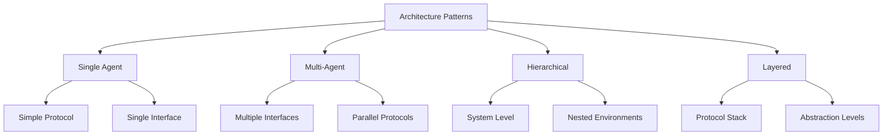

# Architecture Patterns Guide

## Overview

This guide describes UVM/OVM/Saola testbench architecture patterns and how to automatically generate them from validation documents. The agent must understand and implement appropriate architectural patterns based on the extracted requirements.

## 1. Architecture Selection Framework

### 1.1 Pattern Decision Matrix

```python
def select_architecture_pattern(validation_doc):
    factors = {
        'protocol_complexity': analyze_protocol_complexity(validation_doc),
        'interface_count': count_interfaces(validation_doc),
        'verification_scope': determine_verification_scope(validation_doc),
        'methodology': extract_methodology(validation_doc)
    }
    
    if factors['interface_count'] == 1 and factors['protocol_complexity'] == 'simple':
        return 'single_agent_pattern'
    elif factors['interface_count'] > 1 and factors['verification_scope'] == 'block':
        return 'multi_agent_pattern'
    elif factors['verification_scope'] == 'system':
        return 'hierarchical_pattern'
    else:
        return 'layered_pattern'
```

### 1.2 Architecture Patterns Overview



## 2. Single Agent Architecture Pattern

### 2.1 When to Use
- Single interface verification
- Simple protocols (UART, SPI, I2C)
- Block-level testing
- Focused feature verification

### 2.2 Architecture Template

```systemverilog
// Single Agent Architecture
class {protocol}_env extends uvm_env;
  `uvm_component_utils({protocol}_env)
  
  // Core components
  {protocol}_agent agent;
  {protocol}_scoreboard sb;
  {protocol}_coverage cov;
  
  // Configuration
  {protocol}_env_config cfg;
  
  function new(string name = "{protocol}_env", uvm_component parent = null);
    super.new(name, parent);
  endfunction
  
  virtual function void build_phase(uvm_phase phase);
    super.build_phase(phase);
    
    // Get configuration
    if (!uvm_config_db#({protocol}_env_config)::get(this, "", "config", cfg)) begin
      cfg = {protocol}_env_config::type_id::create("cfg");
    end
    
    // Create components
    agent = {protocol}_agent::type_id::create("agent", this);
    sb = {protocol}_scoreboard::type_id::create("sb", this);
    cov = {protocol}_coverage::type_id::create("cov", this);
    
    // Configure agent
    uvm_config_db#({protocol}_agent_config)::set(this, "agent", "config", cfg.agent_cfg);
  endfunction
  
  virtual function void connect_phase(uvm_phase phase);
    super.connect_phase(phase);
    
    // Connect analysis ports
    agent.monitor.analysis_port.connect(sb.analysis_export);
    agent.monitor.analysis_port.connect(cov.analysis_export);
  endfunction
endclass
```

### 2.3 Agent Structure

```systemverilog
class {protocol}_agent extends uvm_agent;
  `uvm_component_utils({protocol}_agent)
  
  // Agent components
  {protocol}_driver driver;
  {protocol}_monitor monitor;
  {protocol}_sequencer sequencer;
  
  // Configuration
  {protocol}_agent_config cfg;
  
  virtual function void build_phase(uvm_phase phase);
    super.build_phase(phase);
    
    // Get configuration
    if (!uvm_config_db#({protocol}_agent_config)::get(this, "", "config", cfg)) begin
      `uvm_fatal("CONFIG", "Agent configuration not found")
    end
    
    // Create components based on configuration
    monitor = {protocol}_monitor::type_id::create("monitor", this);
    
    if (cfg.is_active == UVM_ACTIVE) begin
      driver = {protocol}_driver::type_id::create("driver", this);
      sequencer = {protocol}_sequencer::type_id::create("sequencer", this);
    end
  endfunction
  
  virtual function void connect_phase(uvm_phase phase);
    super.connect_phase(phase);
    
    if (cfg.is_active == UVM_ACTIVE) begin
      driver.seq_item_port.connect(sequencer.seq_item_export);
    end
  endfunction
endclass
```

## 3. Multi-Agent Architecture Pattern

### 3.1 When to Use
- Multiple independent interfaces
- Parallel protocol verification
- Cross-interface interactions
- System integration testing

### 3.2 Architecture Template

```systemverilog
class multi_agent_env extends uvm_env;
  `uvm_component_utils(multi_agent_env)
  
  // Multiple agents

  {{ agent.type }} {{ agent.name }};

  
  // Cross-agent components
  multi_protocol_scoreboard sb;
  system_coverage cov;
  virtual_sequencer vseqr;
  
  // Configuration
  multi_agent_env_config cfg;
  
  virtual function void build_phase(uvm_phase phase);
    super.build_phase(phase);
    
    // Create agents

    {{ agent.name }} = {{ agent.type }}::type_id::create("{{ agent.name }}", this);

    
    // Create system components
    sb = multi_protocol_scoreboard::type_id::create("sb", this);
    cov = system_coverage::type_id::create("cov", this);
    vseqr = virtual_sequencer::type_id::create("vseqr", this);
  endfunction
  
  virtual function void connect_phase(uvm_phase phase);
    super.connect_phase(phase);
    
    // Connect to virtual sequencer

    if ({{ agent.name }}.cfg.is_active == UVM_ACTIVE) begin
      vseqr.{{ agent.name }}_seqr = {{ agent.name }}.sequencer;
    end

    
    // Connect to scoreboard

    {{ agent.name }}.monitor.analysis_port.connect(sb.{{ agent.name }}_export);

  endfunction
endclass
```

### 3.3 Virtual Sequencer Pattern

```systemverilog
class virtual_sequencer extends uvm_sequencer;
  `uvm_component_utils(virtual_sequencer)
  
  // Sequencer handles

  {{ agent.sequencer_type }} {{ agent.name }}_seqr;

  
  function new(string name = "virtual_sequencer", uvm_component parent = null);
    super.new(name, parent);
  endfunction
endclass

class virtual_sequence extends uvm_sequence;
  `uvm_object_utils(virtual_sequence)
  
  // Virtual sequencer handle
  virtual_sequencer vseqr;
  
  virtual task body();
    // Cross-agent sequence coordination
    fork

      begin
        // {{ sequence_group.description }}

        {{ sequence.name }}_seq.start(vseqr.{{ sequence.agent }}_seqr);

      end

    join
  endtask
endclass
```

## 4. Hierarchical Architecture Pattern

### 4.1 When to Use
- System-level verification
- Nested verification environments
- IP integration testing
- Complex SoC verification

### 4.2 Hierarchical Structure

```systemverilog
class system_env extends uvm_env;
  `uvm_component_utils(system_env)
  
  // Sub-environments

  {{ sub_env.type }} {{ sub_env.name }};

  
  // System-level components
  system_scoreboard system_sb;
  system_coverage system_cov;
  system_virtual_sequencer system_vseqr;
  
  virtual function void build_phase(uvm_phase phase);
    super.build_phase(phase);
    
    // Create sub-environments

    {{ sub_env.name }} = {{ sub_env.type }}::type_id::create("{{ sub_env.name }}", this);

    
    // Create system components
    system_sb = system_scoreboard::type_id::create("system_sb", this);
    system_cov = system_coverage::type_id::create("system_cov", this);
    system_vseqr = system_virtual_sequencer::type_id::create("system_vseqr", this);
  endfunction
  
  virtual function void connect_phase(uvm_phase phase);
    super.connect_phase(phase);
    
    // Connect sub-environment virtual sequencers

    system_vseqr.{{ sub_env.name }}_vseqr = {{ sub_env.name }}.vseqr;

    
    // System-level connections
    connect_system_analysis_ports();
  endfunction
endclass
```

### 4.3 System Virtual Sequencer

```systemverilog
class system_virtual_sequencer extends uvm_sequencer;
  `uvm_component_utils(system_virtual_sequencer)
  
  // Sub-environment virtual sequencers

  {{ sub_env.vseqr_type }} {{ sub_env.name }}_vseqr;

  
  function new(string name = "system_virtual_sequencer", uvm_component parent = null);
    super.new(name, parent);
  endfunction
endclass
```

## 5. Layered Architecture Pattern

### 5.1 When to Use
- Protocol stack verification
- Different abstraction levels
- Transaction-level modeling
- Performance analysis

### 5.2 Layered Structure

```systemverilog
class layered_env extends uvm_env;
  `uvm_component_utils(layered_env)
  
  // Protocol layers

  {{ layer.type }}_env {{ layer.name }}_env;

  
  // Layer adapters

  {{ adapter.type }} {{ adapter.name }};

  
  virtual function void build_phase(uvm_phase phase);
    super.build_phase(phase);
    
    // Create layer environments

    {{ layer.name }}_env = {{ layer.type }}_env::type_id::create("{{ layer.name }}_env", this);

    
    // Create adapters

    {{ adapter.name }} = {{ adapter.type }}::type_id::create("{{ adapter.name }}", this);

  endfunction
  
  virtual function void connect_phase(uvm_phase phase);
    super.connect_phase(phase);
    
    // Connect layers through adapters

    {{ connection.source }}.{{ connection.port }}.connect({{ connection.destination }}.{{ connection.port }});

  endfunction
endclass
```

### 5.3 Protocol Layer Adapter

```systemverilog
class protocol_adapter#(type UPPER_TRANS = uvm_sequence_item,
                       type LOWER_TRANS = uvm_sequence_item) extends uvm_component;
  `uvm_component_utils(protocol_adapter#(UPPER_TRANS, LOWER_TRANS))
  
  // Analysis ports
  uvm_analysis_export#(UPPER_TRANS) upper_export;
  uvm_analysis_port#(LOWER_TRANS) lower_port;
  
  virtual function void write(UPPER_TRANS upper_tx);
    LOWER_TRANS lower_tx;
    
    // Convert upper layer transaction to lower layer
    lower_tx = convert_transaction(upper_tx);
    
    // Send to lower layer
    lower_port.write(lower_tx);
  endfunction
  
  virtual function LOWER_TRANS convert_transaction(UPPER_TRANS upper_tx);
    // Protocol-specific conversion logic
    // This method must be implemented for each protocol layer
  endfunction
endclass
```

## 6. Component Patterns

### 6.1 Monitor Patterns

**Protocol Monitor**:
```systemverilog
class {protocol}_monitor extends uvm_monitor;
  `uvm_component_utils({protocol}_monitor)
  
  virtual {interface_name}_if vif;
  uvm_analysis_port#({transaction_type}) analysis_port;
  
  // Monitor configuration
  {protocol}_monitor_config cfg;
  
  virtual task run_phase(uvm_phase phase);
    {transaction_type} tx;
    
    forever begin
      // Collect transaction from interface
      collect_transaction(tx);
      
      // Validate protocol compliance
      if (cfg.protocol_checking_enable) begin
        validate_protocol(tx);
      end
      
      // Send to analysis port
      analysis_port.write(tx);
    end
  endtask
  
  virtual task collect_transaction({transaction_type} tx);
    // Protocol-specific collection logic

    collect_{{ signal_group.name }}(tx);

  endtask
endclass
```

**Bus Monitor with Protocol Checking**:
```systemverilog
class bus_monitor extends uvm_monitor;
  // Protocol checker instance
  {protocol}_checker protocol_checker_inst;
  
  virtual function void build_phase(uvm_phase phase);
    super.build_phase(phase);
    protocol_checker_inst = {protocol}_checker::type_id::create("protocol_checker_inst", this);
  endfunction
  
  virtual task run_phase(uvm_phase phase);
    fork
      monitor_transactions();
      protocol_checker_inst.check_protocol();
    join
  endtask
endclass
```

### 6.2 Driver Patterns

**Pipelined Driver**:
```systemverilog
class pipelined_driver extends uvm_driver#({transaction_type});
  `uvm_component_utils(pipelined_driver)
  
  {transaction_type} pipeline_queue[$];
  int pipeline_depth;
  
  virtual task run_phase(uvm_phase phase);
    fork
      get_transactions();
      drive_transactions();
    join
  endtask
  
  virtual task get_transactions();
    {transaction_type} tx;
    forever begin
      seq_item_port.get_next_item(tx);
      pipeline_queue.push_back(tx);
      seq_item_port.item_done();
    end
  endtask
  
  virtual task drive_transactions();
    forever begin
      if (pipeline_queue.size() > 0) begin
        drive_single_transaction(pipeline_queue.pop_front());
      end else begin
        @(vif.driver_cb);
      end
    end
  endtask
endclass
```

### 6.4 Intel PSB Register Model Patterns

**PSB RAL Integration**:
```systemverilog
class psb_reg_env extends uvm_env;
  `uvm_component_utils(psb_reg_env)
  
  // PSB register model
  psb_reg_block reg_model;
  
  // IOSF sideband agents
  iosf_sb_agent sbep0_agent;
  iosf_sb_agent sbep1_agent;
  iosf_sb_agent sbepcfg_agent;
  
  // Register adapters
  iosf_sb_adapter sbep0_adapter;
  iosf_sb_adapter sbep1_adapter;
  iosf_sb_adapter sbepcfg_adapter;
  
  // Register predictors
  uvm_reg_predictor#(iosf_sb_txn) sbep0_predictor;
  uvm_reg_predictor#(iosf_sb_txn) sbep1_predictor;
  uvm_reg_predictor#(iosf_sb_txn) sbepcfg_predictor;
  
  virtual function void build_phase(uvm_phase phase);
    super.build_phase(phase);
    
    // Create register model
    reg_model = psb_reg_block::type_id::create("reg_model");
    reg_model.build();
    reg_model.lock_model();
    
    // Create agents
    sbep0_agent = iosf_sb_agent::type_id::create("sbep0_agent", this);
    sbep1_agent = iosf_sb_agent::type_id::create("sbep1_agent", this);
    sbepcfg_agent = iosf_sb_agent::type_id::create("sbepcfg_agent", this);
    
    // Create adapters
    sbep0_adapter = iosf_sb_adapter::type_id::create("sbep0_adapter");
    sbep1_adapter = iosf_sb_adapter::type_id::create("sbep1_adapter");
    sbepcfg_adapter = iosf_sb_adapter::type_id::create("sbepcfg_adapter");
    
    // Create predictors
    sbep0_predictor = uvm_reg_predictor#(iosf_sb_txn)::type_id::create("sbep0_predictor", this);
    sbep1_predictor = uvm_reg_predictor#(iosf_sb_txn)::type_id::create("sbep1_predictor", this);
    sbepcfg_predictor = uvm_reg_predictor#(iosf_sb_txn)::type_id::create("sbepcfg_predictor", this);
  endfunction
  
  virtual function void connect_phase(uvm_phase phase);
    super.connect_phase(phase);
    
    // Connect register model to each endpoint
    reg_model.sbep0_map.set_sequencer(sbep0_agent.sequencer, sbep0_adapter);
    reg_model.sbep1_map.set_sequencer(sbep1_agent.sequencer, sbep1_adapter);
    reg_model.sbepcfg_map.set_sequencer(sbepcfg_agent.sequencer, sbepcfg_adapter);
    
    // Connect predictors
    sbep0_agent.monitor.analysis_port.connect(sbep0_predictor.bus_in);
    sbep1_agent.monitor.analysis_port.connect(sbep1_predictor.bus_in);
    sbepcfg_agent.monitor.analysis_port.connect(sbepcfg_predictor.bus_in);
    
    sbep0_predictor.map = reg_model.sbep0_map;
    sbep1_predictor.map = reg_model.sbep1_map;
    sbepcfg_predictor.map = reg_model.sbepcfg_map;
    
    sbep0_predictor.adapter = sbep0_adapter;
    sbep1_predictor.adapter = sbep1_adapter;
    sbepcfg_predictor.adapter = sbepcfg_adapter;
  endfunction
endclass
```

**PSB Test Pattern with Exclusion Lists**:
```systemverilog
class psb_reg_test extends base_test;
  `uvm_component_utils(psb_reg_test)
  
  string general_exclude_list[$];
  string epcfg_only_list[$];
  
  virtual function void build_phase(uvm_phase phase);
    super.build_phase(phase);
    
    // PSB-specific exclusions
    general_exclude_list.push_back("PSB_FUSE_PULL_STATUS");
    general_exclude_list.push_back("PSB_ERRSTS");
    general_exclude_list.push_back("PSB_SBEPCFG_SIDE_CLK_CDC_CONTROL");
    general_exclude_list.push_back("PSB_SBEP0_SIDE_CLK_CDC_CONTROL");
    general_exclude_list.push_back("PSB_SBEP1_SIDE_CLK_CDC_CONTROL");
    
    // Configure register exclusions
    uvm_config_db#(string)::set(this, "*", "reg_exclude_list", general_exclude_list);
  endfunction
endclass
```

## 7. Configuration Patterns

### 7.1 Hierarchical Configuration

```systemverilog
class system_config extends uvm_object;
  `uvm_object_utils(system_config)
  
  // Environment configurations

  {{ env.config_type }} {{ env.name }}_cfg;

  
  // System-level settings
  bit enable_system_coverage;
  bit enable_performance_monitoring;
  int test_timeout;
  
  function new(string name = "system_config");
    super.new(name);
    
    // Create sub-configurations

    {{ env.name }}_cfg = {{ env.config_type }}::type_id::create("{{ env.name }}_cfg");

  endfunction
  
  virtual function void configure_for_test(string test_name);
    case (test_name)

      "{{ test.name }}": configure_{{ test.name }}();

      default: configure_default();
    endcase
  endfunction
endclass
```

### 7.2 Factory Configuration

```systemverilog
class factory_config;
  static function void configure_factory();
    // Register type overrides

    {{ override.base_type }}::type_id::set_type_override({{ override.override_type }}::get_type());

    
    // Register instance overrides

    {{ instance_override.base_type }}::type_id::set_inst_override(
      {{ instance_override.override_type }}::get_type(),
      "{{ instance_override.instance_path }}");

  endfunction
endclass
```

## 8. Methodology-Specific Patterns

### 8.1 UVM Patterns

- **Factory Pattern**: Component creation and type overrides
- **Phase Pattern**: Simulation phase management
- **Analysis Pattern**: TLM communication
- **Configuration Pattern**: Centralized configuration

### 8.2 OVM Patterns

- **Component Hierarchy**: OVM component structure
- **Message System**: OVM reporting mechanism
- **Factory System**: OVM factory implementation

### 8.3 Saola Patterns

- **BFM Integration**: Saola Bus Functional Models
- **Test Manager**: Saola test execution
- **Signal Groups**: Saola signal management

## Best Practices

1. **Pattern Selection**: Choose appropriate pattern for verification scope
2. **Modularity**: Design for reusability and maintainability
3. **Configuration**: Use centralized configuration management
4. **Scalability**: Design for future expansion
5. **Documentation**: Document architectural decisions
6. **Validation**: Verify architectural choices with stakeholders

---

*Next: [05-code-generation-templates.md](05-code-generation-templates.md) - Learn about SystemVerilog code generation templates*